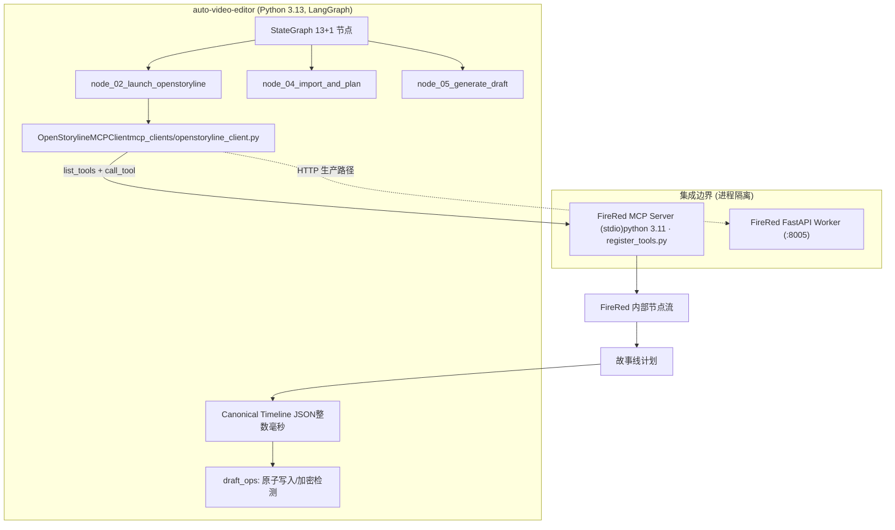

基于对两个 GitHub 仓库源码的解析以及您上传的 4 份设计/评审文档的深度比对，我为您整理了一份详尽的集成评审与落地方案 MD 文档。

该文档指出了早期附件文档中的**重大事实偏差**（如误判 `auto-video-editor` 为 VAD 粗剪器、忽视 Python 3.11/3.13 版本硬冲突等），并结合仓库真实代码结构给出了修正后的 **MCP-first** 集成方案。

您可以直接复制以下 Markdown 内容保存为文档：

```markdown
# FireRed-OpenStoryline 嵌入 auto-video-editor：集成评审与落地方案 (最终修正版)

**评审日期**：2026-09-17  
**核验对象**：
- `wayyet/FireRed-OpenStoryline` (AI 驱动短视频叙事 Agent)
- `wayyet/auto-video-editor` (LangGraph 剪映草稿自动化工作流)

---

## 1. 执行摘要 (TL;DR)

经过对两个 GitHub 仓库源码的公网核验，**前序附件文档（原设计 v1.0、评审 v1、落地方案 v1）的立论前提已被证伪**。
- **事实纠正 1**：`auto-video-editor` 并非文档假设的“VAD 静音切除/SceneDetect 确定性粗剪引擎”，而是一个 **LangGraph 驱动的剪映草稿自动化编排器**（13+1 节点、interrupt/resume 关卡、SqliteSaver/Postgres 持久化）。
- **事实纠正 2**：`auto-video-editor` **已经内建了 OpenStoryline 的集成点**（`node_02_launch_openstoryline.py`、`mcp_clients/openstoryline_client.py`、`jy_common/asr_client.py`），集成并非从零开始。
- **事实纠正 3**：存在 Python 版本硬冲突（FireRed 要求 3.11，主项目实测 3.13.11），前序文档推荐的“单进程 Direct Adapter”方案风险最高且不可行，**MCP-first（进程隔离）才是唯一正确路线**。
- **事实纠正 4**：数据契约的最终目标不是 EDL/OTIO，而是剪映的 `draft_content.json`。

**最终结论**：保留附件文档中“分层架构、契约先行、整数毫秒、幂等安全”的工程纪律；但必须推翻其接口虚构、环境合并与路线顺序，**以主项目既有的 MCP 客户端为起点进行加固**。

---

## 2. 仓库真实形态核验

### 2.1 FireRed-OpenStoryline (智能大脑)
- **定位**：AI 驱动的短视频编辑 Pipeline (MCP + LLM)。
- **核心能力**：智能搜素材、脚本生成 (Few-shot 风格迁移)、BGM/配音推荐、对话式精剪、Skill 归档、AI 转场、ASR 粗剪。
- **真实技术栈**：Python 3.11 (Conda)、MoviePy、FFmpeg、LangChain、FastAPI (端口 8005)、MCP Server。
- **真实目录结构**：节点位于 `src/open_storyline/nodes/core_nodes/`（如 `understand_clips.py`, `generate_script.py`, `plan_timeline.py`），MCP 工具经 `mcp/register_tools.py` 注册。

### 2.2 auto-video-editor (编排中枢)
- **定位**：LangGraph 驱动的剪映草稿自动化工作流。
- **核心能力**：13+1 节点 StateGraph、三处人工关卡（①重排/②BGM/③版式）、心跳监控、Postgres/Sqlite 持久化。
- **真实技术栈**：Python 3.13.11、LangGraph、Windows/PowerShell 优先、剪映草稿生成 (`draft_content.json`)。
- **已有集成点**：
  - `node_02_launch_openstoryline.py` (启动 OpenStoryline)
  - `mcp_clients/openstoryline_client.py` (Week 2 已交付的 MCP 客户端)
  - `jy_common/asr_client.py` (FireRedASR2S 客户端，端点 `:8009`)

---

## 3. 附件设计合理性验证与优缺点分析

### 3.1 附件设计的“合理部分”（应保留的资产）
| 设计点 | 验证结果 | 诊断说明 |
| :--- | :--- | :--- |
| **“确定性引擎 + 智能 Agent”分层** | ✅ 合理 | 规则处理与 LLM 创作解耦，符合高可用流水线设计。 |
| **引入 Adapter 层与统一时间线契约** | ✅ 合理 | 隔离数据格式差异，主项目内部采用整数毫秒 Canonical Timeline。 |
| **默认关闭 AI 转场** | ✅ 合理 | 官方明示 AIGC 转场成本高、结果不可控，默认关闭保障主流程。 |
| **整数毫秒 (int ms) 作为时间单位** | ✅ 合理 | 避免浮点数序列化累积误差导致卡点错位。 |
| **Skill 复用与批量化生产** | ✅ 合理 | 有产品价值，FireRed 原生支持 `.storyline/skills/SKILL.md`。 |
| **幂等性与 Job 隔离** | ✅ 合理 | 同 `job_id` 重跑不污染旧结果，需结合主项目 `draft_ops/atomic_writer.py`。 |

### 3.2 附件设计的“严重缺陷”（必须推翻的证伪项）
| 附件设计断言 | 判定 | 真实源码事实与修正 |
| :--- | :--- | :--- |
| **auto-video-editor 是 VAD/SceneDetect 粗剪器** | ❌ **重大错误** | 实为 LangGraph 剪映编排器，输出物是 `draft_content.json` 而非 EDL。 |
| **推荐“先单进程 Direct Adapter MVP”** | ❌ **需反转** | Python 3.11 vs 3.13 硬冲突，单进程合并环境是**否决项**。必须 **MCP-first**。 |
| **直接 `import third_party.FireRed-OpenStoryline...`** | ❌ **语法错误** | Python 模块名不可包含连字符 `-`。且跨版本 import 会破坏环境。 |
| **虚构接口名 (UnderstandingNode / generate_storyline)** | ❌ **无源码依据** | 真实节点为 `understand_clips.py` 等，MCP 工具名需运行时 `list_tools()` 发现。 |
| **大文件直接通过 MCP 参数传输** | ❌ **严重不合理** | 音视频必须通过 URI (如 `file:///E:/...`) 或 artifact ID 传递。 |
| **EDL/OTIO 作为主要交换格式** | ❌ **终点错位** | 一等公民是剪映草稿，EDL 仅作为可选导出器。 |

### 3.3 综合优缺点分析
- **优点**：
  1. **优势互补**：`auto-video-editor` 负责“变短”和“剪映编排”，`FireRed` 负责“变好”和“语义创作”。
  2. **契约先行**：使用 JSON Schema 约束时间线，便于后续微服务化与校验。
  3. **防御性方法论**：提出了版本锁定、双依赖锁、运行时接口发现等高质量工程纪律。
- **缺点**：
  1. **目标对象失焦**：前序文档作者未做源码审计，为想象中的粗剪器写了不可运行的代码。
  2. **依赖极其臃肿**：若按原文合并 PyTorch、torchaudio、MoviePy、LangGraph，环境必崩。
  3. **平台假设偏差**：原文建议 docker-compose 优先，但主项目实为 Windows/PowerShell-native。

---

## 4. 修正后的集成方案 (v2.0 MCP-First)

### 4.1 架构决策记录 (ADR)
- **ADR-001 进程隔离是硬性要求**：FireRed (3.11) 与主项目 (3.13) 解释器永不合并。
- **ADR-002 MCP-first 路线**：开发期使用 stdio 启动 MCP Server 子进程；生产期使用 FastAPI(8005) HTTP Worker。
- **ADR-003 契约三层映射**：`Canonical JSON(ms)` ↔ `MCP payload` ↔ `draft_content.json`。
- **ADR-004 接口运行时发现**：禁止硬编码未证实工具名，客户端启动时 `list_tools()` 动态匹配意图。

### 4.2 目标架构图


### 4.3 数据契约：Canonical Timeline (主项目内部契约)
```json
{
  "$schema": "http://json-schema.org/draft-07/schema#",
  "title": "CanonicalTimeline",
  "type": "object",
  "required": ["job_id", "source_media", "clips"],
  "properties": {
    "job_id": { "type": "string" },
    "clips": {
      "type": "array",
      "items": {
        "type": "object",
        "required": ["clip_id", "source_in_ms", "source_out_ms", "timeline_in_ms", "timeline_out_ms"],
        "properties": {
          "clip_id": { "type": "string" },
          "source_in_ms": { "type": "integer" },
          "timeline_in_ms": { "type": "integer" },
          "transcript": { "type": "string" },
          "semantic_tags": { "type": "array", "items": { "type": "string" } }
        }
      }
    }
  }
}
```

---

## 5. 详细落地步骤与代码骨架

### Step 1: 双环境隔离与版本锁定
**严禁合并 `requirements.txt`**。
```powershell
# 1. FireRed 侧 (独立 Conda 环境)
conda create -n storyline python=3.11 -y
conda activate storyline
git submodule add https://github.com/wayyet/FireRed-OpenStoryline.git third_party/FireRed-OpenStoryline
cd third_party/FireRed-OpenStoryline && git checkout 
pip install -r requirements.txt
# Windows 需手动下载 models.zip 和 resource.zip

# 2. 主项目侧 (保持现有 venv 3.13)
.\.venv\Scripts\Activate.ps1
python -m pip install -e  ...
```

### Step 2: 加固 MCP 客户端 (运行时发现)
修改 `mcp_clients/openstoryline_client.py`，增加动态发现与超时控制：
```python
class OpenStorylineMCPClient:
    async def __aenter__(self):
        self._session = ...  # 既有 stdio 启动逻辑
        self._tools = {t.name: t for t in await self._session.list_tools()}
        # 按意图映射工具，缺失则 fail-fast
        self._require_tools("load_media", "understand_clips", "plan_timeline") 
        return self

    async def build_plan(self, canonical: dict, intent: str) -> dict:
        # payload 字段名以 self._tools[...].inputSchema 为准，禁止臆测
        ...
```

### Step 3: 集成点映射与改造
| 现有资产 | 改造内容 |
| :--- | :--- |
| `node_02_launch_openstoryline.py` | 增加 Conda 3.11 环境检测、`config.toml` Key 检测、子进程存活心跳。 |
| `node_04_import_and_plan.py` | 输入侧接入 Canonical Timeline Schema 校验。 |
| `node_05_generate_draft.py` | 输出侧对接 `draft_ops/atomic_writer.py`，生成 `manifest.json`。 |
| `state.py` | 新增 `NotRequired` 字段：`canonical_timeline`、`storyline_plan`。 |

### Step 4: 幂等与安全机制
- **输出隔离**：`outputs/{job_id}/` (manifest / timeline / draft_content.json)。
- **原子写入**：复用 `draft_ops/atomic_writer.py`，先写临时目录，成功后原子替换。
- **API Key 管理**：FireRed 侧进 `config.toml`，主项目进 `.env`，严禁入库。

---

## 6. 分阶段实施 Roadmap

| 阶段 | 核心任务 | 交付物 |
| :--- | :--- | :--- |
| **Phase 0: 源码审计** | 锁定双仓 commit；启动 MCP Server 导出 `list_tools()` 真实清单。 | `storyline_tools_inventory.md` |
| **Phase 1: 契约加固** | 实现 Canonical Timeline Pydantic 模型；加固 MCP 客户端超时/取消逻辑。 | `contract.py` + 84 条既有测试全绿 |
| **Phase 2: 幂等观测** | Job 隔离目录、防重写测试、心跳看门狗覆盖 MCP 子进程。 | 集成测试 (防重写/取消) |
| **Phase 3: 对话精剪** | 将 FireRed 的 refine 链路接入 LangGraph 的关卡①/②/③ `resume` 机制。 | 精剪 E2E 测试 |
| **Phase 4: 产品化** | 生产 Worker 化 (FastAPI + HTTP)；Windows 部署脚本；指标面板。 | 部署手册 |

---

## 7. 测试与验收清单

| 测试层级 | 验证用例 | 通过标准 |
| :--- | :--- | :--- |
| **既有回归** | `python -m pytest -v` | 84 条全绿，不因集成破坏既有逻辑。 |
| **Contract** | Canonical Timeline Schema 校验 | 非法输入 (越界/负数) 100% 拒绝。 |
| **Integration** | `node_02` -> `list_tools` -> `node_05` | 生成的 `draft_content.json` 可被剪映正常打开。 |
| **Rendering** | 剪映导出成片 | 音画偏差 < 50ms。 |
| **Retry** | 同 `job_id` 重跑 | 旧输出不被污染 (`atomic_writer` 生效)。 |
| **Security** | 路径穿越 / Key 泄漏扫描 | 零命中。 |

---

## 8. 最终结论

**一句话总结**：`auto-video-editor` 已经把“变短”和“剪映编排”做成了 LangGraph 流水线，**不要新开一条 Direct Adapter 路线**；FireRed-OpenStoryline 应该通过主项目**既有的 MCP 客户端**把“变好”的能力接进来——把已有的那条路修成高速公路。
```