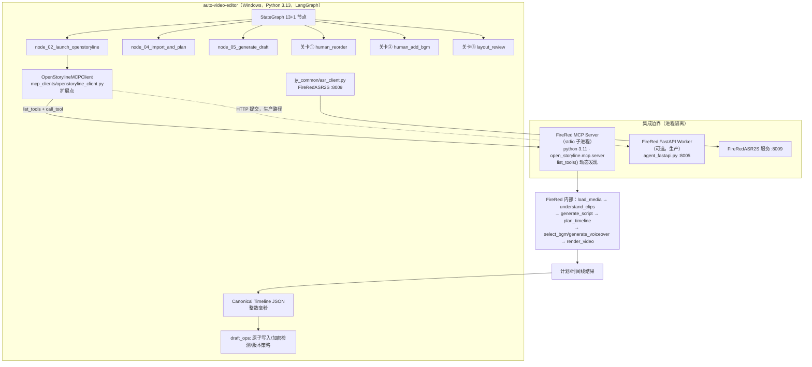

两份仓库（`wayyet/FireRed-OpenStoryline` 与 `wayyet/auto-video-editor`）我已在公网逐目录核验完毕，发现了**三份附件文档共同的重大事实错误**，并据此完成了修正版集成方案。下面先给出核心结论，随后是完整的 MD 文档全文（可直接保存为 `FireRed-OpenStoryline-integration-review-v2.md`）。
**核验发现速览：**
- 附件评审文档断言"两仓库无法公开访问"已不成立——两个仓库现在均可访问，且 `auto-video-editor` 的真实形态与三份文档的假设完全不同；
- `auto-video-editor` 实际是一个 **LangGraph 驱动的剪映草稿自动化工作流**（13+1 节点、interrupt/resume 关卡①②③、SqliteSaver/Postgres、84 条测试全过、Windows 优先、Python 3.13.11），**不是**文档假设的"VAD 静音切除/SceneDetect 粗剪引擎"；
- 它**已经内建了 OpenStoryline 集成点**：`node_02_launch_openstoryline.py`、`mcp_clients/openstoryline_client.py`（Week 2 已交付）、`jy_common/asr_client.py`（FireRedASR2S 客户端，端点 `127.0.0.1:8009`）；
- `FireRed-OpenStoryline` 真实节点为 `core_nodes/` 下的 `understand_clips.py`、`generate_script.py`、`plan_timeline*.py`、`select_bgm.py`、`render_video.py` 等，**文档中的 `UnderstandingNode`/`ScriptNode`/`BGMNode`/`CompositionNode` 类名与 `mcp/tools/`、`mcp/client.py` 路径均不存在**；
- FireRed 要求 Python 3.11，主项目实测 3.13.11 → "单进程 Direct Adapter" 方案风险最高，**MCP-first 才是正确路线**（与评审文档结论相反）。
---

# FireRed-OpenStoryline 嵌入 auto-video-editor：集成评审与落地方案 v2.0
> **基于两仓库公网源码核验的修订版**
> 评审日期：2026-09-17
> 前序文档：`FireRed-OpenStoryline-Integration-Design.md`（原设计 v1.0）、
> `FireRed-OpenStoryline-auto-video-editor-集成评审.md`（评审 v1）、
> `FireRed-OpenStoryline 集成 auto-video-editor：设计评审与落地方案文档`（落地方案 v1）
> 核验对象：
> - https://github.com/wayyet/FireRed-OpenStoryline
> - https://github.com/wayyet/auto-video-editor
> - https://github.com/FireRedTeam/FireRed-OpenStoryline（官方上游）
> 核验方法：公网抓取两仓库 README / 目录树 / docs（guide.md），逐条比对三份附件文档断言
---
## 1. 执行摘要（TL;DR）
1. **三份附件文档的立论前提已被证伪。** 它们把 `auto-video-editor` 假设为
   "VAD 静音切除 + SceneDetect 场景切分 + ASR + EDL 导出"的确定性粗剪引擎。
   实测该仓库是一个 **LangGraph 驱动的剪映草稿自动化工作流**：13+1 节点
   StateGraph、三处人工关卡（①重排/②BGM/③版式）、SqliteSaver→Postgres
   持久化、心跳监控、Windows/PowerShell 部署、Python 3.13.11 实测。
2. **集成并非从零开始。** `auto-video-editor` 已交付三个 OpenStoryline 集成点：
   `node_02_launch_openstoryline.py`、`mcp_clients/openstoryline_client.py`
   （Week 2 交付物）、`jy_common/asr_client.py`（FireRedASR2S 客户端）。
   Week 5 已为 `node_17_inject_english_tts` 预留 FireRedTTS2 桩。
3. **`FireRed-OpenStoryline` 的真实接口与原设计文档的引用不符。**
   真实节点位于 `src/open_storyline/nodes/core_nodes/`（函数式模块：
   `understand_clips.py`、`generate_script.py`、`plan_timeline.py`、
   `select_bgm.py`、`render_video.py`…），MCP 工具经
   `mcp/register_tools.py` 注册（无 `mcp/tools/` 子目录、无 `mcp/client.py`）。
   文档中的 `UnderstandingNode`/`ScriptNode` 等类名、
   `generate_storyline`/`conversational_refine` 工具名**均未经证实，禁止硬编码**。
4. **评审文档"先单进程 Direct Adapter、MCP 放最后"的推荐需要反转向。**
   主项目运行于 Python 3.13.11，FireRed 要求 Python 3.11——单进程方案必须
   破坏环境隔离；而 MCP 子进程/服务化路径**主项目已实现一半**，风险最低。
   修正后的推荐：**双环境隔离 + MCP-first（开发期 stdio 子进程 / 生产期 HTTP
   Worker），Python 直接导入仅作为 FireRed 3.11 环境内的调试兜底**。
5. **数据契约的主目标格式不是 EDL/OTIO，而是剪映 `draft_content.json`。**
   保留"整数毫秒 Canonical Timeline JSON"作为中间契约（三份文档此点正确），
   但其下游落点是主项目已有的 `draft_ops/`（原子写入、加密检测、版本策略）。
**一句话结论：架构分层、契约先行、幂等与安全原则全部保留；但集成入口、
接口名称、数据格式、阶段顺序必须按源码事实全部重写。**
---
## 2. 仓库事实核验（新证据）
### 2.1 wayyet/FireRed-OpenStoryline 实测结论
> 该仓库为 `FireRedTeam/FireRed-OpenStoryline` 的公共 fork（镜像），
> Apache-2.0 协议。README 与官方一致。
**实测目录结构（摘自公网目录树）：**
```text
FireRed-OpenStoryline/
├── src/open_storyline/
│   ├── mcp/
│   │   ├── hooks/
│   │   ├── __init__.py
│   │   ├── register_tools.py        # ← MCP 工具在此注册
│   │   ├── sampling_handler.py
│   │   ├── sampling_requester.py
│   │   └── server.py                # ← MCP Server 启动入口
│   ├── nodes/
│   │   ├── core_nodes/              # ← 真实节点目录（见下）
│   │   ├── node_manager.py
│   │   ├── node_schema.py
│   │   ├── node_state.py
│   │   └── node_summary.py
│   ├── skills/
│   │   └── skills_io.py             # ← 仅此一个文件
│   ├── storage/                     # ✅ 存在（Agent Memory）
│   ├── utils/
│   ├── agent.py
│   └── config.py                    # ← config.toml 解析
├── docs/source/zh/guide.md          # 使用教程（已核验）
├── prompts/                          # LLM 提示模板
├── resource/                         # bgms/ fonts/ script_templates/ emojis
├── web/                              # WebUI
├── agent_fastapi.py                  # FastAPI 服务
├── cli.py
├── config.toml
├── build_env.sh / download.sh / run.sh
├── Dockerfile                        # 官方镜像 openstoryline/openstoryline:v1.0.1
└── requirements.txt
```
**真实节点清单（`nodes/core_nodes/`，逐文件核验）：**
```text
asr_node.py                  base_node.py           filter_clips.py
generate_ai_transition.py    generate_script.py     generate_voiceover.py
group_clips.py               load_media.py          plan_timeline.py
plan_timeline_ai_transition.py  plan_timeline_pro.py  recommend_effects.py
render_video.py              script_template_rec.py search_media.py
search_web_topic.py          select_bgm.py          speech_rough_cut.py
split_shots.py               understand_clips.py
```
**关键运行事实（README / guide.md 核验）：**
| 事实 | 结论 |
| --- | --- |
| Python 3.11 + Conda 环境 | ✅ `conda create -n storyline python=3.11` |
| MCP Server 启动 | ✅ `PYTHONPATH=src python -m open_storyline.mcp.server` |
| Web/FastAPI | ✅ `uvicorn agent_fastapi:app --host 127.0.0.1 --port 8005`；Docker Web 端口 7860 |
| Docker 镜像 | ✅ `openstoryline/openstoryline:v1.0.1`（Docker Hub + 阿里云镜像源） |
| API-Key | ✅ 必须先在 `config.toml` 配置 LLM/VLM/Pexels/TTS |
| 资源包 | ✅ `download.sh`（Linux/macOS）；Windows 手动下载 models.zip→`.storyline`、resource.zip→`resource` |
| AI 转场 | ✅ 依赖第三方 AIGC 生成服务，官方警告"成本较高、结果不可控，建议按需开启" |
| ASR 粗剪 | ✅ 2026-03-22 引入（`speech_rough_cut.py`），`storyline.local_asr` 需 `torchaudio` |
| Skill 机制 | ✅ 技能存于 `.storyline/skills/<name>/SKILL.md`（front-matter 格式），重启 MCP 服务生效 |
| 自定义资源 | ✅ BGM：`resource/bgms/meta.json`（scene/genre/mood/lang 四维标签）；字体：`resource/fonts/font_info.json`；文案模板：`resource/script_templates` |
| GitHub Release | ❌ 无；**但存在 Docker 镜像 tag `v1.0.1`，可作为版本锚点**（评审文档"无 Release"部分成立） |
| 核心依赖 | ✅ MoviePy、FFmpeg、LangChain（Acknowledgements 明确列出） |
**证伪项（原设计文档引用的接口）：**
| 原设计引用 | 实测 |
| --- | --- |
| `mcp/tools/`（暴露 search_media/segment/script_gen） | ❌ 无该目录；工具经 `register_tools.py` 注册 |
| `mcp/client.py` | ❌ mcp/ 目录下不存在 |
| `nodes/understanding_node.py` 等独立节点文件 | ❌ 实际为 `core_nodes/understand_clips.py` 等，命名方式不同 |
| `UnderstandingNode` / `ScriptNode` / `BGMNode` / `CompositionNode` / `TransitionNode` 类 | ❌ 未证实；真实代码为节点文件 + `node_manager.py` 调度，类名需读源码确认 |
| `skills/rough_cut_skill`、`asr_cut_skill`、`style_transfer_skill` 目录 | ❌ `skills/` 仅 `skills_io.py`；用户技能在 `.storyline/skills/` |
| MCP 工具名 `generate_storyline` / `conversational_refine` | ⚠️ 未证实；**必须在运行时通过 `list_tools()` 枚举实际名称** |
### 2.2 wayyet/auto-video-editor 实测结论
> 官方自述："AI 视频剪辑自动化工作流 — Week 2 + Week 3 交付物"
> （README 已含 Week 5 内容）。**注意：这与三份附件文档的假设完全不同。**
**真实技术形态：**
| 维度 | 实测事实 |
| --- | --- |
| 编排框架 | **LangGraph StateGraph**（13+1 节点；Week 5 拓扑扩展至 16 节点） |
| 宿主应用 | **剪映**——生成/驱动 `draft_content.json` 草稿文件 |
| 节点流水线 | `node_01_clean_cache` → `node_02_launch_openstoryline` → `node_03_open_preview` → `node_04_import_and_plan` → `node_05_generate_draft` → `node_06_human_reorder`(关卡①) → `node_07_speed_fit` → `node_08_add_subtitles` → `node_09_inject_fx` → `node_10_inject_text_fx` → `node_11_inject_sticker` → `node_12_human_add_bgm`(关卡②) → `node_13_adjust_volume` →（Week 5：`bridge_snapshot2`/`node_16a_translate_and_check`/`node_checkpoint3_layout_review`(关卡③)/`node_17_inject_english_tts`） |
| 持久化 | `SqliteSaver`（默认）→ `AsyncPostgresSaver`（EDB Postgres 16.11 Docker）；`config.make_checkpointer()` |
| 人机协同 | LangGraph `interrupt/resume`，关卡 payload 统一为 `"①"/"②"/"③"`，`resume_all_pending()` 统一恢复 |
| 运维 | 心跳 daemon（10s 写 `heartbeat.txt`）+ 任务计划程序监控（120s 超时告警）；两级超时看门狗（默认关闭） |
| 底层库 | `draft_ops/atomic_writer.py`（原子写入）、`encryption_detector.py`（草稿加密检测）、`version_strategy.py`（版本策略） |
| **已有 OpenStoryline 集成点** | ① `node_02_launch_openstoryline.py`（启动 OpenStoryline）② `mcp_clients/openstoryline_client.py`（**Week 2 已交付的 MCP 客户端**）③ `jy_common/asr_client.py`（**FireRedASR2S 客户端**：`ASR_BACKEND=firered`、`FIRERED_ASR_ENDPOINT=http://127.0.0.1:8009/transcribe`）④ Week 5 `node_17` 预留 FireRedTTS2 |
| 平台 | **Windows 优先**（PowerShell 脚本、任务计划程序、`E:\Documents\kuaishou\...` 本机路径） |
| Python | **3.13.11 实测通过**（要求 3.10+） |
| 依赖来源 | 本机可编辑安装 `langgraph-main` 仓库 libs + httpx/pytest/langgraph-checkpoint-sqlite |
| 测试基线 | **单元 60 + 集成 24 = 84 条全部通过**（Week 3 末） |
| 输出物 | 剪映草稿 + 字幕（含英文翻译/TTS 占位），**非 EDL/OTIO** |
### 2.3 关键发现：三份附件的共性问题
```text
发现 F1：auto-video-editor 不是"确定性粗剪引擎"，而是"剪映自动化编排器"。
        三份文档的 Step2 适配层、EDL 契约、"粗剪结果"输入全部指向一个
        不存在的形态。
发现 F2：集成已经部分存在。Week 2 的 mcp_clients/openstoryline_client.py
        就是"MCP 子进程/服务调用"路线的既成事实。三份文档（尤其评审文档
        "MCP 不作为第一阶段核心链路"的结论）与仓库实际演进方向相反。
发现 F3：Python 版本错配是硬约束。FireRed=3.11，主项目=3.13.11。
        任何"单进程 Direct Adapter"都必须合并两个 interpreter，
        torch/torchaudio/MoviePy 冲突风险最高。评审文档低估了这一点
        （它只说"风险较高"，实际上这是否决性理由）。
发现 F4：原设计的接口名称是虚构的。UnderstandingNode / ScriptNode /
        generate_storyline / conversational_refine / mcp/tools/ 等
        均与源码不符。落地方案文档 §4.2 的 adapter 代码引用了
        canonical timeline（毫秒）→ 秒制 segments 的转换——转换本身
        方向正确，但目标 payload 结构未经 FireRed 侧验证。
发现 F5：两个文档时序矛盾。落地方案与评审文档成文于 2026-09-17，
        而 auto-video-editor 的 Week 3 末补全记录为 2026-09-16、
        Week 5 内容已在其 README 中——说明文档作者在可访问仓库的
        情况下仍未做源码审计（或审计的是假想对象）。
```
---
## 3. 附件设计逐条验证
### 3.1 原设计文档核心断言验证
| # | 原设计断言 | 判定 | 说明 |
| --- | --- | --- | --- |
| 1 | auto-video-editor 是 VAD/SceneDetect 确定性粗剪器 | ❌ 重大错误 | 实为 LangGraph 剪映编排器（见 §2.2） |
| 2 | 粗剪输出 `EDL + Clips + SRT` 交给 FireRed | ❌ | 实际数据对象是剪映 `draft_content.json` |
| 3 | MCP 子进程嵌入为推荐方案（★★★★★） | ✅ **方向正确** | 与仓库既成事实一致；本项目维持此路线 |
| 4 | 方案 B：`import open_storyline.nodes.*` 直接调用 | ❌ | 类名虚构 + Python 版本错配（3.11 vs 3.13） |
| 5 | `from third_party.FireRed-OpenStoryline...` | ❌ | 连字符模块名语法非法（评审已指出，正确） |
| 6 | `sys.path.append("third_party/.../src")` | ❌ | cwd 依赖，脆弱（评审已指出，正确） |
| 7 | `git submodule add` 引入官方仓库 | ⚠️ | 应改为 fork + 锁定 commit（评审已指出，正确） |
| 8 | 合并 requirements.txt，MoviePy 锁 2.x | ❌ | 两个环境根本不该合并（本版强化为否决项） |
| 9 | Docker 构建期执行 `download.sh` | ❌ | 网络依赖破坏构建缓存（评审已指出，正确） |
| 10 | `app.mount` 合并 FastAPI | ❌ | 生命周期/路由冲突（评审已指出，正确） |
| 11 | `enable_ai_transition = false` 默认关闭 | ✅ | 与官方 README 警告一致 |
| 12 | ConfigLoader 兼容 TOML+YAML | ❌ | 徒增冲突面（评审已指出，正确） |
| 13 | Skill 沉淀/复用 | ✅ | FireRed 原生支持（`.storyline/skills/SKILL.md`），无需自造 skill.json |
| 14 | `final.mp4`/`skill.json` 直接覆盖 | ❌ | 需要 job 隔离 + 原子提交（评审已指出，正确；主项目已有 atomic_writer 可复用） |
### 3.2 评审文档核心断言验证
| # | 评审断言 | 判定 | 说明 |
| --- | --- | --- | --- |
| 1 | 两仓库无法公开访问，按"仓库待审计"处理 | ⚠️ 已过时 | 现均可访问；本版完成其要求的 Phase 0 源码审计 |
| 2 | 固定 Git commit 而非 main 分支 | ✅ | 正确；补充：Docker tag `v1.0.1` 亦可作锚点 |
| 3 | MCP/直接导入/FastAPI 三线并进范围过大 | ✅ | 正确；但结论应为"MCP 一条线"，而非"Direct Adapter 一条线" |
| 4 | 工具名/类名未证实，需 `list_tools()` 后生成客户端 | ✅ | **本版已证实其怀疑是对的**（§2.1 证伪表） |
| 5 | **推荐"先单进程 Adapter MVP，MCP 不作第一阶段核心链路"** | ❌ **需反转** | 三个新事实推翻它：①主项目已交付 MCP client；②Python 3.13/3.11 硬冲突；③Windows 主进程嵌入 FireRed 3.11 环境复杂度远高于 stdio 子进程 |
| 6 | EDL 表达力不足，改用内部 JSON 时间线 | ✅ | 方向正确；本版进一步明确：内部 JSON 的下游是剪映 draft_content.json |
| 7 | 整数毫秒统一时间单位 | ✅ | 采纳为核心契约 |
| 8 | 大文件不进 MCP 参数，只传 URI/artifact | ✅ | 采纳 |
| 9 | LLM 只出计划、确定性渲染器校验执行 | ✅ | 采纳；主项目侧的"确定性渲染器"= 剪映客户端 + draft_ops |
| 10 | 幂等：`job_id+input_hash+config_hash`、原子改名 | ✅ | 采纳；主项目已有 atomic_writer.py/version_strategy.py 基础 |
| 11 | Windows 也应优先 Worker | ⚠️ 部分采纳 | 采纳"FireRed 进程隔离"；但主项目 Windows 优先是既定事实，方案需 Windows-native（PowerShell/计划程序），不能照搬 docker-compose 优先 |
| 12 | 统一 TOML / Pydantic Settings | ✅ | 采纳 |
| 13 | 拒绝 `AgentMemory` 直接共享 | ✅ | 采纳；FireRed 侧 storage 属于其 Agent 内部状态 |
### 3.3 落地方案文档核心断言验证
| # | 落地方案断言 | 判定 | 说明 |
| --- | --- | --- | --- |
| 1 | 采用"选项 A：Direct Adapter → Worker" | ❌ | 理由同 §3.2#5：与仓库既成 MCP 路线冲突 + 版本错配 |
| 2 | 时间线 JSON Schema（整数毫秒）| ✅ | 采纳，本版给出修订版（增加 draft 映射字段） |
| 3 | `sys.path.insert` + 绝对路径解决连字符导入 | ⚠️ | 语法上可行但架构上错误（应进程隔离）；且 `parents[3]` 的相对层级耦合目录深度，脆弱 |
| 4 | `StorylineWorkerClient`（HTTP 8005） | ✅ | 采纳为生产形态；与 FireRed `agent_fastapi.py` 既有端口约定一致 |
| 5 | 模块放 `src/auto_video_editor/storyline/` | ⚠️ | 主项目实际无 `src/` 布局（扁平布局 + `pyproject.toml`），应改放 `storyline/` 或并入既有 `jy_common/` |
| 6 | 子模块锁定 commit | ✅ | 采纳 |
| 7 | 渲染防重写测试（同 job_id 重复执行） | ✅ | 采纳；主项目已有原子写入库可直接测 |
| 8 | 音画同步 < 50ms 验收 | ✅ | 采纳 |
| 9 | 未验证 FireRed 侧真实接口即写出 adapter 代码 | ❌ | `media_list`/`segments` payload 为单方面假设（发现 F4） |
---
## 4. 优缺点分析
### 4.1 三份文档各自的优点（应保留的资产）
| 文档 | 保留资产 |
| --- | --- |
| 原设计 | ①"确定性引擎 + 智能大脑"的职责划分叙事；②Skill 复用/批量生产的产品视角；③贡献回 FireRed 上游的双向生态思路（`auto_cutter_skill` PR）；④默认关闭 AI 转场的成本控制 |
| 评审 | ①"以 list_tools 实测生成客户端"的防御性方法论（被证实完全正确）；②时间单位/幂等/artifact 追溯的工程纪律；③测试清单分层与质量指标体系；④版本锁定与双依赖锁策略 |
| 落地方案 | ①Canonical Timeline JSON Schema（毫秒）可直接沿用；②防重写/音画同步的验收口径；③"决策留痕"的文档格式（决定+理由） |
### 4.2 三份文档共同的缺点（本版修正项）
1. **目标对象失焦**：为想象中的 auto-video-editor 设计，产出"可运行代码"实为不可运行（模块名/布局/输出格式三重错位）。
2. **接口引用无源码依据**：把 README 功能描述直接升格为类名/工具名，违反"先 list_tools / 先读源码、后写代码"。
3. **环境模型错误**：忽略 Python 3.11 与 3.13.11 的硬边界，把"依赖冲突"降格为"风险较高"而非"否决项"。
4. **路线顺序颠倒**：在"主项目已交付 MCP client"的事实下，仍推荐从 Direct Adapter 起步，等于推翻既有代码重做。
5. **数据契约终点错位**：以 EDL/OTIO 为一等公民；实际一等公民是剪映 `draft_content.json`（含加密检测/版本策略/原子写入约束）。
6. **平台假设偏差**：评审建议 docker-compose 优先；主项目为 Windows/PowerShell-native，容器化只能是 FireRed 侧的可选项。
---
## 5. 修正后的集成方案（v2.0）
### 5.1 架构决策记录（ADR）
```text
ADR-001 进程隔离是硬性要求
  理由：FireRed 需 Python 3.11（conda storyline），主项目实测 3.13.11。
  决定：两个解释器永远不合并；集成仅通过 MCP stdio 子进程 或 HTTP。
  后果：放弃 方案B（Direct Adapter）作为主链路；仅保留在 FireRed 自身
        3.11 环境内做节点级联调的用法。
ADR-002 MCP-first，与仓库既成事实对齐
  理由：mcp_clients/openstoryline_client.py 已交付并被 node_02 使用；
        MCP stdio 由 FireRed 自带解释器启动，天然满足 ADR-001。
  决定：开发期 = 主进程 stdio 启动 MCP Server 子进程；
        生产/多机 = FireRed FastAPI(8005) 独立 Worker + HTTP 提交。
  后果：评审文档的"先 Direct Adapter"阶段被替换为"加固现有 MCP 链路"。
ADR-003 契约三层：Canonical JSON(ms) ↔ MCP payload ↔ draft_content.json
  理由：主项目一等输出是剪映草稿；FireRed 一等输出是其时间线/计划。
  决定：定义 Canonical Timeline（整数毫秒）为主项目内部契约；
        MCP 工具 payload 以 list_tools 实测 schema 为准生成 Pydantic 模型；
        Canonical → draft_content.json 的映射交给主项目既有 draft_ops。
  后果：EDL/OTIO 降级为可选导出器。
ADR-004 接口名称一律运行时发现
  理由：register_tools.py 注册的真实工具名未在任何文档中列明；
        generate_storyline / conversational_refine 均为未经证实的名称。
  决定：客户端启动时 list_tools() → 按 name 匹配意图（加载素材/理解/
        脚本/时间线/BGM/配音/渲染），缺失即 fail-fast 并输出诊断。
  后果：禁止在任何源码中硬编码未证实工具名。
ADR-005 默认关闭 AI 转场
  理由：官方 README 明示成本高、结果不可控。
  决定：config 中 enable_ai_transition=false；仅显式 --pro 开启。
```
### 5.2 目标架构

### 5.3 数据契约 v2（修订版）
#### 5.3.1 Canonical Timeline（主项目内部契约，整数毫秒）
在落地方案文档 Schema 基础上，增加剪映映射所需字段：
```json
{
  "$schema": "http://json-schema.org/draft-07/schema#",
  "title": "CanonicalTimeline",
  "type": "object",
  "required": ["job_id", "source_media", "clips"],
  "properties": {
    "job_id":       { "type": "string" },
    "created_at_ms":{ "type": "integer" },
    "source_media": {
      "type": "array",
      "items": {
        "type": "object",
        "required": ["media_id", "file_path", "duration_ms"],
        "properties": {
          "media_id":   { "type": "string" },
          "file_path":  { "type": "string" },
          "sha256":     { "type": "string" },
          "duration_ms":{ "type": "integer" }
        }
      }
    },
    "clips": {
      "type": "array",
      "items": {
        "type": "object",
        "required": ["clip_id","source_media_id","source_in_ms",
                     "source_out_ms","timeline_in_ms","timeline_out_ms"],
        "properties": {
          "clip_id":         { "type": "string" },
          "source_media_id": { "type": "string" },
          "source_in_ms":    { "type": "integer" },
          "source_out_ms":   { "type": "integer" },
          "timeline_in_ms":  { "type": "integer" },
          "timeline_out_ms": { "type": "integer" },
          "transcript":      { "type": "string" },
          "scene_id":        { "type": "string" },
          "quality_score":   { "type": "number" },
          "semantic_tags":   { "type": "array", "items": { "type": "string" } },
          "content_hash":    { "type": "string" }
        }
      }
    },
    "audio": {
      "type": "object",
      "properties": {
        "bgm_ref":   { "type": ["string","null"] },
        "voiceover": { "type": ["string","null"] }
      }
    },
    "subtitles": {
      "type": "object",
      "properties": {
        "zh": { "type": ["string","null"] },
        "en": { "type": ["string","null"] }
      }
    }
  }
}
```
#### 5.3.2 MCP payload 规则
- 大文件只传绝对路径 URI / artifact id（Windows 下 `file:///E:/...` 或 UNC 路径），**不进 MCP 参数**；
- payload 模型用 Pydantic 定义，**字段名以 `list_tools()` 返回的 inputSchema 为准反向生成**，禁止手写臆测字段；
- 返回结果统一落盘为 artifact， Canonical Timeline 更新后交 `draft_ops` 写草稿。
#### 5.3.3 任务状态机（沿用评审文档，落主项目 State）
```text
PENDING → RUNNING → WAITING_FOR_REVIEW(关卡①/②/③) → RENDERING
        → SUCCEEDED | FAILED | CANCELLED
```
主项目对应物：LangGraph `interrupt` payload（`"①"/"②"/"③"`）+
`resume_all_pending()`；新增字段进 `state.py` 一律 `NotRequired` +
`.get()` 兜底（与 Week 5 约定一致）。
### 5.4 集成点映射（改哪些现有文件）
| 现有资产 | 改造内容 |
| --- | --- |
| `mcp_clients/openstoryline_client.py` | ① 启动时 `list_tools()` 并缓存工具目录；② 按意图映射工具（load_media/understand_clips/generate_script/plan_timeline/select_bgm/generate_voiceover/render_video 等，以实测名为准）；③ 增加 per-call 超时与 `anyio` 取消；④ 结果 artifact 化 |
| `node_02_launch_openstoryline.py` | 增加：FireRed conda env 检测（3.11）、`config.toml` 存在性/Key 检测、子进程存活心跳、崩溃重拉（复用 monitoring/timeout_watchdog 模式） |
| `node_04_import_and_plan.py` | 输入侧接入 Canonical Timeline；增加 schema 校验 |
| `node_05_generate_draft.py` | 输出侧对接 `draft_ops/atomic_writer.py`（已有）；生成 `outputs/{job_id}/manifest.json` |
| `jy_common/asr_client.py` | 保持 `FIRERED_ASR_ENDPOINT` 注入；补 connection error 分类重试 |
| `state.py` | 新增 `NotRequired` 字段：`canonical_timeline`、`storyline_plan`、`storyline_artifacts` |
| `config.py` | 新增 `[storyline]` 段：conda env 路径、MCP 启动命令、`enable_ai_transition=false`、超时/重试参数（统一 TOML） |
| 新增 `storyline/contract.py` | Canonical Timeline Pydantic 模型 + JSON Schema 导出 |
| 新增 `storyline/mapper.py` | Canonical ↔ draft_content.json 双向映射（含毫秒→微秒换算与帧对齐） |
| 新增 `tests/contract/`、`tests/integration/test_storyline_mcp.py` | 契约校验 + MCP 连通性 + 防重写 + 取消回收 |
### 5.5 版本锁定（两条锁链）
```bash
# FireRed 侧：fork + 固定 commit（<KNOWN_GOOD_COMMIT> 换成实测通过的 hash）
git submodule add https://github.com/wayyet/FireRed-OpenStoryline.git third_party/FireRed-OpenStoryline
git -C third_party/FireRed-OpenStoryline checkout <KNOWN_GOOD_COMMIT>
# FireRed 环境（独立，绝不合入主环境）
conda create -n storyline python=3.11 -y
conda activate storyline
cd third_party/FireRed-OpenStoryline
# Windows：手动下载 models.zip → .storyline/，resource.zip → resource/
pip install -r requirements.txt
# 主项目环境（3.13，保持现状）
.\.venv\Scripts\Activate.ps1
python -m pip install -e <langgraph-main libs> ...   # 既有安装方式不动
# 可选生产镜像（版本锚点）
docker pull openstoryline/openstoryline:v1.0.1
```
### 5.6 关键代码骨架（均标注"以实测接口为准"）
```python
# storyline/contract.py —— Canonical Timeline 模型（毫秒）
from pydantic import BaseModel, Field
class Clip(BaseModel):
    clip_id: str
    source_media_id: str
    source_in_ms: int = Field(ge=0)
    source_out_ms: int = Field(ge=0)
    timeline_in_ms: int = Field(ge=0)
    timeline_out_ms: int = Field(ge=0)
    transcript: str = ""
class CanonicalTimeline(BaseModel):
    job_id: str
    source_media: list[dict]
    clips: list[Clip]
    # 校验：timeline_in/out 单调、source_out>source_in、媒体存在
# mcp_clients/openstoryline_client.py 扩展骨架（运行时发现工具）
class OpenStorylineMCPClient:
    async def __aenter__(self):
        self._session = ...                      # 既有 stdio 启动逻辑
        self._tools = {t.name: t for t in await self._session.list_tools()}
        self._require_tools("load_media", "understand_clips",
                            "generate_script", "plan_timeline",
                            "select_bgm", "render_video")
        # ^ 若缺工具 → fail-fast，打印 list_tools 全量帮助诊断
        return self
    async def build_plan(self, canonical: dict, intent: str) -> dict:
        # payload 字段名以 self._tools[...].inputSchema 为准，禁止臆测
        ...
```
> ⚠️ 上例工具名仅为**意图占位**，交付前必须替换为
> `PYTHONPATH=src python -m open_storyline.mcp.server` 启动后
> `list_tools()` 的实测输出（对应 `register_tools.py` 注册内容）。
### 5.7 幂等与安全（沿用评审要求，落到主项目机制）
- 输出目录：`outputs/{job_id}/`（manifest.json / timeline.json / draft_content.json / logs/）；
- 复用 `draft_ops/atomic_writer.py` + `version_strategy.py`：先写临时目录，成功后原子替换；
- 幂等键：`job_id + input_hash + config_hash`；同键重跑命中缓存；
- API Key 只进 `config.toml`（FireRed 侧）与主项目 `.env`，禁止入库、禁止入 MCP 日志；
- 关卡 resume 前校验 Canonical Timeline schema，防止人工改动破坏毫秒不变量。
---
## 6. 分阶段路线图（修正版）
| 阶段 | 内容 | 交付物 | 与前序文档差异 |
| --- | --- | --- | --- |
| **Phase 0 源码审计（1~2 天）** | 锁定双仓 commit；在 3.11 环境启动 MCP Server，`list_tools()` 导出工具清单与 inputSchema；跑通 FireRed Web 端最小 demo | `docs/storyline_tools_inventory.md`、锁定后的 submodule 指针 | 评审文档的 Phase 0 保留，**本版已完成一半**（见 §2） |
| **Phase 1 契约与客户端加固（1 周）** | Canonical Timeline Schema；`openstoryline_client` 加固（动态发现/超时/取消/artifact 化）；schema 校验接入 node_04/05 | contract.py + schema.json + 80+ 条既有测试全绿 | 原"Phase 1 实现 Direct Adapter"删除 |
| **Phase 2 幂等与观测（1 周）** | job 隔离目录、manifest、防重写；心跳/超时看门狗覆盖 MCP 子进程；失败分类与重试 | 防重写/取消/超时集成测试 | 新增（评审提出，前文档未落地） |
| **Phase 3 对话式精剪 + Skill（1~2 周）** | refine 链路走关卡①②③ 的 resume；FireRed Skill（`.storyline/skills/SKILL.md`）与主项目 checkpoint 联动；版本 diff | 精剪 E2E 测试 + Skill 模板 2 个 | Skill 用 FireRed 原生格式，弃 skill.json 自造格式 |
| **Phase 4 产品化（1~2 周）** | 生产 Worker 化（FastAPI :8005 + HTTP 提交）；Windows 部署文档；EDL/OTIO 可选导出器；指标（LLM token/耗时/重生成率） | 部署手册 + 指标面板 | Worker 化从"第一阶段"移到生产阶段 |
---
## 7. 测试与验收清单
| 层级 | 用例 | 通过标准 |
| --- | --- | --- |
| 既有回归 | `python -m pytest -v` | 84 条全绿，不因集成破坏 |
| Contract | Canonical Timeline schema 校验（越界/负数/媒体缺失） | 非法输入 100% 拒绝 |
| Contract | MCP `list_tools()` 快照测试 | 工具集变化 → 测试报警（防上游静默升级） |
| Integration | node_02 启动 → list_tools → 生成计划 → node_05 落草稿 | draft_content.json 可被剪映打开 |
| Integration | FireRedASR2S :8009 | 连接失败分类（ECONNREFUSED/TIMEOUT）可重试 |
| Rendering | draft → 剪映导出成片 | 音画偏差 < 50ms |
| Retry | 同 job_id 重跑 | 旧输出不被污染（atomic_writer 生效） |
| Cancel | 关卡①挂起后 cancel | MCP 子进程与 ASR 请求被回收 |
| Security | 路径穿越 / Key 泄漏扫描 | 零命中 |
| Skill | 保存 → 换素材复用 | 风格一致、毫秒时间线合法 |
---
## 8. 风险与对策（更新版）
| 风险 | 等级 | 对策 |
| --- | --- | --- |
| MCP 工具名/schema 与预期不符 | 高 | ADR-004 运行时发现 + 快照测试；Phase 0 完成 inventory |
| FireRed 无 GitHub Release，上游漂移 | 中 | 锁 commit + Docker `v1.0.1` 双锚点；fork 内可自行打 tag |
| Python 3.11/3.13 双环境维护 | 中 | ADR-001 硬隔离；CI 分两个 job 各自验证 |
| Windows stdio 子进程编码/路径问题 | 中 | UTF-8 显式声明；`file:///E:/` URI 规范；冒烟脚本纳入 heartbeat |
| 剪映客户端逆向字段未回填（node_13/资源 ID） | 高（既有） | 与本次集成解耦，按 README 仍需用户行动项推进 |
| LLM 不确定性输出 | 中 | 计划→Canonical 校验→draft_ops 三道闸 |
| AI 转场成本失控 | 低 | 默认关闭，`--pro` 显式开启 |
| 版权（BGM/字体/素材） | 中 | 沿用 FireRed Restricted Mode + 自定义资源库教程 + manifest 留痕 |
---
## 9. 结论
1. **保留**：分层思想、契约先行、整数毫秒、幂等、安全、测试分层——三份文档的工程纪律全部有效。
2. **推翻**：①"auto-video-editor 是确定性粗剪器"的前提；②Direct Adapter 优先的路线；③全部虚构接口名；④EDL 一等公民地位；⑤"合并环境/合并 requirements"。
3. **确立**：以**主项目既有的 MCP 集成点为起点**，按
   `Phase 0 工具清单 → Phase 1 契约加固 → Phase 2 幂等观测 → Phase 3 精剪与 Skill → Phase 4 Worker 化`
   推进；FireRed 侧以 fork + 锁定 commit + 独立 3.11 环境接入，Windows 主进程零侵入。
> 一句话（修订版）：**auto-video-editor 已经把"变短"和"剪映编排"做成了
> LangGraph 流水线，FireRed-OpenStoryline 通过它已有的 MCP 客户端把
> "变好"接进来——不要新开一条 Direct Adapter 路线，把已有的那条路修成
> 高速公路。**
---
### 附录 A：三份文档的推荐路线对比
| 文档 | 推荐路线 | 本版判定 |
| --- | --- | --- |
| 原设计 v1.0 | A+B 混合（MCP 子进程 + Python 导入），MCP ★★★★★ | 方向对（MCP），B 路线删除 |
| 评审 v1 | Direct Adapter MVP → Worker → MCP | MCP 置后：**推翻**（与仓库事实冲突） |
| 落地方案 v1 | 选项 A = Direct Adapter → Worker | 同上：**推翻** |
| **本版 v2.0** | **MCP-first（stdio 子进程 → HTTP Worker），Direct 导入仅限 FireRed 3.11 环境内调试** | 与两仓库现状及版本约束一致 |
### 附录 B：核验来源
- wayyet/auto-video-editor README（LangGraph 节点/测试/Week 5 记录/ASR 端点）— github.com/wayyet/auto-video-editor
- wayyet/FireRed-OpenStoryline README 与目录树、guide.md — github.com/wayyet/FireRed-OpenStoryline
- FireRedTeam/FireRed-OpenStoryline 官方仓库与官网 — github.com/FireRedTeam/FireRed-OpenStoryline · fireredteam.github.io
- 官方镜像：`openstoryline/openstoryline:v1.0.1`（Docker Hub / 阿里云 ACR）
```
---
**使用说明**：将上方代码块内全部内容保存为 `FireRed-OpenStoryline-integration-review-v2.md` 即可。文档的核心增量价值在于：第 2 节的源码级证伪表、第 3 节的三文档逐条判定、以及第 5 节把集成落点修正到主项目**真实存在的** `mcp_clients/openstoryline_client.py`、`node_02`、`draft_ops/`、`jy_common/asr_client.py` 上——这是三份附件文档因未做源码审计而全部缺失的部分。
