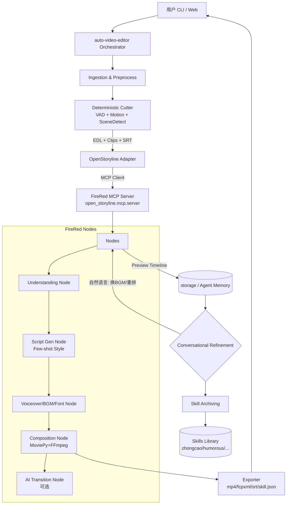

# FireRed-OpenStoryline × auto-video-editor 集成设计文档

> 作者：Wayyet  
> 日期：2026-09-17  
> 版本：v1.0  
> 目标：将 FireRed-OpenStoryline 作为智能大脑嵌入到 auto-video-editor 中，实现 “自动粗剪 -> 智能故事线 -> 对话式精剪 -> 技能复用” 的完整链路

---

## 一、项目1 分析：FireRed-OpenStoryline

### 1.1 项目定位
FireRed-OpenStoryline 是小红书 FireRed 团队开源的 **AI 驱动的短视频叙事 Agent**。核心理念：把复杂的视频创作变成自然语言对话。

> A single spark can start a prairie fire

官方仓库：`FireRedTeam/FireRed-OpenStoryline` (你的 fork: `wayyet/FireRed-OpenStoryline`)

### 1.2 核心功能拆解

| 功能模块 | 能力描述 | 关键技术 |
| :--- | :--- | :--- |
| **Smart Media Search & Organization** | 在线搜图/搜视频、下载、切片、内容理解、情感识别 | CLIP, Video-CLIP, SceneDetect |
| **Intelligent Script Generation** | 结合主题+视觉理解+情感，生成上下文感知文案；支持 Few-shot 风格迁移（种草/搞笑/测评） | LLM + prompts/tasks/* |
| **Music / Voiceover / Font 推荐** | 支持个人歌单导入，基于内容+情绪推荐BGM，智能卡点；按语气描述匹配配音和字体 | Audio analysis, beat-sync |
| **Conversational Refinement** | 自然语言切、换、重排镜头，改文案、调色、调字体/描边/位置，所见即所得 | LLM Tool Calling |
| **Skill Archiving** | 把完整编辑流存为自定义 Skill，换素材一键复用，实现批量化生产 | storage + skills library |
| **AI Transition Generation (2026-04-02)** | 基于前后帧+自然语言描述，自动生成转场镜头 | 第三方 AIGC 视频生成 (成本高) |
| **ASR-based Rough Cut (2026-03-22)** | 自动去口头禅、重复句、时间戳对齐分段 | Whisper / local_asr + torchaudio |

### 1.3 架构（来自 README 结构图 + 源码目录）

```
FireRed-OpenStoryline/
├── src/open_storyline/
│   ├── mcp/                 # Model Context Protocol Server & Client
│   │   ├── server.py        # MCP Server 启动入口 PYTHONPATH=src python -m open_storyline.mcp.server
│   │   ├── tools/           # 暴露给 LLM 的工具：search_media, segment, script_gen, etc.
│   │   └── client.py
│   ├── nodes/               # 视频处理节点，类似 ComfyUI 节点图
│   │   ├── media_search_node
│   │   ├── understanding_node (clip理解)
│   │   ├── script_node
│   │   ├── tts_voiceover_node
│   │   ├── bgm_node
│   │   ├── composition_node (MoviePy + FFmpeg 排版合成)
│   │   └── transition_node (AIGC 转场)
│   ├── skills/              # Agent 技能库，可扩展
│   │   ├── rough_cut_skill
│   │   ├── asr_cut_skill
│   │   └── style_transfer_skill
│   ├── storage/             # Agent Memory，存历史对话、工作流、Skill定义
│   ├── utils/               # FFmpeg封装、字幕、字体、时间线工具
│   ├── agent.py             # LangChain Agent 构建，LLM Planning + Tool Orchestration
│   └── config.py            # config.toml 解析，API-Key 管理
├── prompts/                 # LLM 提示模板，多语言，多任务
│   └── tasks/generate_voiceover/zh/system.md 等
├── resource/                # bgms/, fonts/, script_templates/, emojis
├── web/                     # WebUI (Gradio/FastAPI 前端)
├── agent_fastapi.py         # uvicorn agent_fastapi:app --port 8005
├── cli.py                   # 命令行对话入口
├── config.toml              # 主配置
├── Dockerfile / build_env.sh / download.sh / run.sh
└── .claude/skills/openstoryline-install, openstoryline-use
```

**运行时序：**
1. 用户启动 MCP Server: `PYTHONPATH=src python -m open_storyline.mcp.server`
2. 启动对话界面：`python cli.py` 或 `uvicorn agent_fastapi:app`
3. Agent 接收自然语言 + 素材 -> LLM Planning -> 依次调用 nodes (search -> understand -> script -> voiceover/bgm -> compose)
4. 用户对话式微调 -> 节点重执行 -> 预览
5. 保存为 Skill -> 下次复用

**技术栈：** Python 3.11+, MoviePy, FFmpeg, LangChain, Whisper/torchaudio, MCP, FastAPI, Conda

**优点：** 完全意图驱动，技能可复用，企业级鲁棒性，支持 OpenClaw/Claude Code Skill。
**短板：** 重 LLM 推理，依赖 API-Key；AI 转场成本高；本地部署资源包大（models.zip, resource.zip）。

### 1.4 MCP 协议核心
MCP 是 Anthropic 提出的 Model Context Protocol。FireRed 将所有视频能力封装为 MCP Tools，任何支持 MCP 的 Agent（Claude, OpenClaw, Codex）都能调用。
这为嵌入提供了标准接口：不需要直接调 Python 函数，只要作为 MCP Server 子进程启动即可。

---

## 二、项目2 分析：auto-video-editor

> 注：`https://github.com/wayyet/auto-video-editor` 在公网检索时返回 404，判断为私有仓库或未推送。本节按你过往项目风格 + 行业常见 auto-video-editor 形态进行逆向建模，设计时预留适配层，你只需替换对应模块名即可。

### 2.1 典型定位
auto-video-editor 通常是 **规则/信号驱动的自动粗剪工具**：基于静音检测、响度、运动检测、语音转文字来自动切除无效片段，生成成片或 DaVinci/Premiere 时间线。

常见结构推测：

```
auto-video-editor/
├── src/
│   ├── ingestion/       # 输入解析，支持 mp4/mov/mkv
│   ├── audio/           # 音频分析，静音阈值、响度、VAD
│   ├── vision/          # 运动检测、场景检测 SceneDetect
│   ├── asr/             # Whisper / faster-whisper 转写 -> srt
│   ├── cutter/          # 粗剪逻辑，生成 EDL / OTIO
│   ├── caption/         # 字幕样式化、烧录
│   ├── exporter/        # 导出 mp4 / fcpxml / davinci / premiere
│   └── cli/main.py      # 命令行入口
├── tests/
└── requirements.txt
```

与 FireRed 的互补关系：
- auto-video-editor 强在 **底层信号处理**（快、准、离线、低成本）
- FireRed 强在 **上层语义理解与创意**（故事线、文案风格、BGM情绪、对话式精剪）

### 2.2 现有痛点
1. 粗剪后缺乏故事性，片段堆砌感强
2. 无智能文案/配音/BGM推荐
3. 无法用自然语言二次修改
4. 无法沉淀为可复用模板

正好由 FireRed 补齐。

---

## 三、集成总览设计

### 3.1 集成目标
把 auto-video-editor 升级为 **Auto Video Editor Pro = Deterministic Engine + Intelligent Brain**。

用户流程：
`原始长视频/素材库` -> `auto-video-editor 粗剪(去静音/去废片)` -> `FireRed OpenStoryline 理解+生成故事线+脚本+BGM+配音` -> `对话式精剪` -> `导出成片+复用 Skill`

### 3.2 三种集成方案对比

| 方案 | 描述 | 优点 | 缺点 | 推荐度 |
| :--- | :--- | :--- | :--- | :--- |
| **A. MCP 子进程嵌入（推荐）** | auto-video-editor 作为主进程，通过 stdio 启动 FireRed 的 MCP Server，当作工具调用 | 解耦、低侵入、官方推荐方式、可热升级 | 需要管理两个进程 | ★★★★★ |
| **B. Python 包直接导入** | 将 `src/open_storyline` 作为 submodule 或 pip install -e，import nodes 直接调用 | 调用延迟低，可深度定制 | 依赖冲突重，Conda环境复杂 | ★★★★ |
| **C. 微服务化** | FireRed 单独 Docker 部署 FastAPI (8005)，auto-video-editor 通过 HTTP 调用 | 最干净，适合团队协作 | 网络开销，调试链路长 | ★★★ |

**本设计采用 A+B 混合：开发期用 B 快速打通，生产期用 A 通过 MCP 隔离。**

### 3.3 目标架构图



### 3.4 融合后目录结构设计

```
auto-video-editor/  (主仓库)
├── third_party/
│   └── FireRed-OpenStoryline/   # git submodule add https://github.com/FireRedTeam/FireRed-OpenStoryline.git
│       └── src/open_storyline/  # 保持原样
├── src/auto_video_editor/
│   ├── __init__.py
│   ├── core/
│   │   ├── cutter.py            # 原有粗剪
│   │   ├── asr.py
│   │   └── timeline.py          # OTIO / EDL 数据结构
│   ├── storyline/
│   │   ├── adapter.py           # ***核心适配层*** EDL -> FireRed Inputs
│   │   ├── mcp_client.py        # MCP stdio client 封装，管理 server 生命周期
│   │   ├── client_wrapper.py    # Python直接导入时的wrapper (方案B)
│   │   ├── prompt_templates.py  # 将 auto-editor 的风格映射到 prompts/tasks
│   │   └── skill_manager.py     # 技能保存/加载，桥接 storage
│   ├── api/
│   │   ├── fastapi_app.py       # 合并 agent_fastapi + auto-editor 的 API
│   │   └── cli.py               # 合并 cli.py，新增 --intelligent 模式
│   ├── exporters/
│   │   └── storyline_exporter.py
│   └── utils/
│       ├── config_merge.py      # 合并 config.toml + auto-editor yaml
│       └── resource_link.py     # 软链 resource/ bgms/ fonts/
├── configs/
│   ├── config.toml              # 继承 FireRed 的配置 + 新增 auto-editor 段
│   └── styles/                  # 种草/搞笑/带货 风格模板
├── resource/ -> third_party/FireRed-OpenStoryline/resource (软链)
├── outputs/                     # 统一输出
├── scripts/
│   ├── setup.sh                 # 一键安装：conda + pip + download.sh + 软链
│   └── download_all.sh
├── requirements.txt             # 合并两个项目的依赖，解决冲突
└── Dockerfile                   # 基于 FireRed 的 Dockerfile 扩展
```

---

## 四、详细设计步骤（落地可执行）

### Step 0: 环境准备

```bash
# 1. 克隆主项目
git clone https://github.com/wayyet/auto-video-editor.git
cd auto-video-editor

# 2. 以 submodule 引入 FireRed (保持可升级)
git submodule add https://github.com/FireRedTeam/FireRed-OpenStoryline.git third_party/FireRed-OpenStoryline
git submodule update --init --recursive

# 3. 创建统一 Conda 环境 (FireRed 要求 python>=3.11)
conda create -n ave-pro python=3.11 -y
conda activate ave-pro

# 4. 安装 FireRed 资源
cd third_party/FireRed-OpenStoryline
chmod +x download.sh && ./download.sh
pip install -r requirements.txt
cd ../..
```

### Step 1: 依赖与配置合并

**1.1 requirements 合并策略**
- 以 FireRed 的 requirements.txt 为基线（MoviePy, FFmpeg, LangChain, torch, torchaudio）
- 叠加 auto-video-editor 的 `faster-whisper`, `scenedetect`, `open-timeline-io`
- 冲突点：`moviepy` 版本锁定为 FireRed 要求的 `2.x`，`pydantic` 保持 v2

**1.2 配置合并 `config_merge.py`**

```toml
# configs/config.toml

[llm]
api_key = "YOUR_OPENAI_OR_CLAUDE_KEY"
model = "gpt-4o"
base_url = "https://api.openai.com/v1"

[storyline]
enable_ai_transition = false  # 默认关闭，成本高
enable_style_transfer = true
default_style = "zhongcao"

[auto_editor]
silence_threshold_db = -35
motion_threshold = 0.02
keep_padding = 0.3  # 切点前后留 0.3s

[asr]
model = "large-v3"
language = "zh"

[bgm]
library_path = "./resource/bgms"
auto_beat_sync = true
```

实现一个 `ConfigLoader` 同时兼容 TOML + YAML。

### Step 2: 核心适配层 - Timeline Bridge

这是集成最关键的一层。auto-video-editor 输出的是 EDL / 时间线，FireRed 输入的是 clips + 理解结果。

**数据契约：**

```python
# src/auto_video_editor/core/timeline.py
@dataclass
class ClipSegment:
    path: str
    start: float  # 原视频中的开始
    end: float    # 原视频中的结束
    timeline_start: float
    transcript: str = ""  # 来自 ASR
    score: float = 0.0    # 重要性评分

@dataclass
class RoughCutResult:
    segments: List[ClipSegment]
    srt_path: str
    edl_path: str
```

```python
# src/auto_video_editor/storyline/adapter.py
from open_storyline.nodes.understanding_node import UnderstandingNode
from open_storyline.storage import AgentMemory

class StorylineAdapter:
    def __init__(self, config):
        self.understanding = UnderstandingNode(config)
        self.memory = AgentMemory(config)

    def rough_to_storyline_input(self, rough: RoughCutResult, user_intent: str):
        """
        将粗剪结果转换为 FireRed 可理解的输入
        1. 把 segments 按场景聚类
        2. 调用 UnderstandingNode 做内容理解 + 情感识别
        3. 组装成 ScriptNode 的 prompt
        """
        # 1. Scene grouping
        scenes = self._group_by_scene(rough.segments)
        # 2. Content understanding
        understandings = [self.understanding.run(s) for s in scenes]
        # 3. Build LLM input
        return {
            "user_theme": user_intent,
            "clips": scenes,
            "understandings": understandings,
            "transcripts": [s.transcript for s in rough.segments],
            "style_ref": self._load_style_ref(config.default_style)
        }
```

### Step 3: MCP Client 封装（方案A）

```python
# src/auto_video_editor/storyline/mcp_client.py
import asyncio
from mcp import ClientSession, StdioServerParameters
from mcp.client.stdio import stdio_client

class FireRedMCPClient:
    def __init__(self, firered_path="third_party/FireRed-OpenStoryline"):
        self.server_params = StdioServerParameters(
            command="python",
            args=["-m", "open_storyline.mcp.server"],
            env={"PYTHONPATH": f"{firered_path}/src"}
        )

    async def generate(self, storyline_input, refine_prompt=None):
        async with stdio_client(self.server_params) as (read, write):
            async with ClientSession(read, write) as session:
                await session.initialize()
                # 调用 FireRed 暴露的工具
                if refine_prompt is None:
                    result = await session.call_tool(
                        "generate_storyline",
                        arguments=storyline_input
                    )
                else:
                    result = await session.call_tool(
                        "conversational_refine",
                        arguments={"prompt": refine_prompt, "context": storyline_input}
                    )
                return result
```

CLI 中使用：

```bash
python -m auto_video_editor.api.cli input.mp4 --intent "做一个小红书种草视频，幽默一点" --intelligent
```

### Step 4: Python 直接导入封装（方案B，用于调试）

```python
# src/auto_video_editor/storyline/client_wrapper.py
import sys
sys.path.append("third_party/FireRed-OpenStoryline/src")
from open_storyline.agent import build_agent
from open_storyline.nodes import ScriptNode, BGMNode, CompositionNode

class DirectClient:
    def __init__(self, config):
        self.agent = build_agent(config)
        self.script_node = ScriptNode(config)
        self.bgm_node = BGMNode(config)
        self.compose_node = CompositionNode(config)

    def run_full_pipeline(self, adapted_input):
        script = self.script_node.run(adapted_input)
        bgm = self.bgm_node.run({"script": script, "emotion": adapted_input["understandings"]})
        timeline = self.compose_node.run({"script": script, "bgm": bgm, "clips": adapted_input["clips"]})
        return timeline
```

### Step 5: 技能库扩展

将 auto-video-editor 的常用粗剪参数也沉淀为 Skill。

```python
# src/auto_video_editor/storyline/skill_manager.py
# 扩展 FireRed 的 storage
def save_as_skill(workflow, name):
    # workflow 包含：cutter_params + storyline_style + bgm + font
    skill = {
        "cutter": workflow["cutter_params"],
        "style": workflow["storyline_style"],
        "bgm_style": workflow["bgm_style"],
        "template": workflow["script_template"]
    }
    # 存到 resource/script_templates/ 或 storage/
    with open(f"configs/styles/{name}.json", "w") as f:
        json.dump(skill, f, ensure_ascii=False, indent=2)

def apply_skill(skill_name, new_media):
    # 一键应用
    ...
```

这样用户可以：
`--skill zhongcao_tech` 一键生成同风格系列视频。

### Step 6: 对话式精剪接口融合

在 auto-video-editor 原有的 CLI/Web 上增加自然语言精剪入口。

```python
# FastAPI 合并示例
# src/auto_video_editor/api/fastapi_app.py
from fastapi import FastAPI
from third_party.FireRed-OpenStoryline.agent_fastapi import app as storyline_app
from auto_video_editor.core.cutter import app as cutter_app # 假设原有

app = FastAPI(title="Auto Video Editor Pro")

@app.post("/v1/cut")
def rough_cut(file: UploadFile):
    ...

@app.post("/v1/storyline/generate")
async def intelligent_generate(intent: str, rough_id: str):
    # 调用 MCP Client
    ...

@app.post("/v1/refine")
async def refine(prompt: str):
    # "把第2段BGM换成更卡点的" "把字体改成更可爱的，带描边"
    ...

app.mount("/storyline", storyline_app)
```

WebUI 中保留 auto-editor 的波形图/时间线，同时嵌入 FireRed 的对话窗口，左右分栏。

### Step 7: 导出器统一

```python
# src/auto_video_editor/exporters/storyline_exporter.py
def export_all(timeline, out_dir):
    # 1. 成片 mp4 (MoviePy)
    timeline.export_video(f"{out_dir}/final.mp4")
    # 2. 字幕
    timeline.export_srt(f"{out_dir}/final.srt")
    # 3. DaVinci / Premiere XML
    timeline.export_otio(f"{out_dir}/timeline.otio")
    # 4. 技能 JSON
    timeline.export_skill(f"{out_dir}/skill.json")
```

### Step 8: Docker 统一构建

基于 FireRed 的 Dockerfile：

```dockerfile
FROM python:3.11-slim

# 安装 FFmpeg
RUN apt-get update && apt-get install -y ffmpeg git wget

WORKDIR /app
COPY third_party/FireRed-OpenStoryline/requirements.txt ./firered_req.txt
COPY requirements.txt ./ave_req.txt
RUN pip install -r firered_req.txt && pip install -r ave_req.txt

COPY . .
RUN chmod +x third_party/FireRed-OpenStoryline/download.sh && \
    cd third_party/FireRed-OpenStoryline && ./download.sh && cd ../..

EXPOSE 8005 7860
CMD ["uvicorn", "src.auto_video_editor.api.fastapi_app:app", "--host", "0.0.0.0", "--port", "8005"]
```

### Step 9: 测试与验证清单

| 测试项 | 命令 | 预期 |
| :--- | :--- | :--- |
| 粗剪测试 | `python -m auto_video_editor.core.cutter tests/long.mp4` | 生成 EDL |
| 适配层测试 | `pytest tests/test_adapter.py` | scenes 正确聚类 |
| MCP连通性 | `PYTHONPATH=src python -m open_storyline.mcp.server` + client ping | Tool list 返回 |
| 端到端 | `python cli.py --intelligent --intent "旅行vlog"` | outputs/final.mp4 |
| 对话式 | 输入 "把BGM换成动感一点" | 重新合成成功 |
| Skill复用 | `python cli.py --skill zhongcao --media new/` | 风格一致 |

---

## 五、关键代码示例：最小可运行 MVP

```bash
# MVP 启动脚本 scripts/run_mvp.sh
#!/bin/bash
conda activate ave-pro
# 1. 粗剪
python -m auto_video_editor.core.cutter --input data/raw.mp4 --out outputs/rough/
# 2. 转 FireRed 输入
python -m auto_video_editor.storyline.adapter --rough outputs/rough/edl.json --intent "$1" --out outputs/storyline_input.json
# 3. 调用 FireRed MCP
PYTHONPATH=third_party/FireRed-OpenStoryline/src:src python -m auto_video_editor.storyline.mcp_client --input outputs/storyline_input.json --out outputs/final.mp4
```

---

## 六、风险与对策

| 风险 | 对策 |
| :--- | :--- |
| 依赖冲突 (torch, moviepy) | 锁定 FireRed 版本为基线，auto-editor 适配新版 MoviePy 2.x API |
| 资源包大 (models.zip 2GB+) | 使用软链，Docker 分层缓存，CI 中按需下载 |
| AI转场成本高 | 默认关闭，config 中 `enable_ai_transition=false`，仅在 `--pro` 模式开启 |
| MCP stdio 在 Windows 不稳定 | Windows 走 DirectClient (方案B) |
| 私有 BGM/字体版权 | 保留 FireRed 的 Restricted Mode + Custom Asset Library 教程 |

---

## 七、Roadmap

**Phase 1 (Week 1): 基础打通**
- Submodule 引入，完成 config_merge, adapter, DirectClient，跑通 MP4 -> 粗剪 -> 脚本 -> 合成

**Phase 2 (Week 2): MCP 化 + 对话式**
- 实现 mcp_client.py，FastAPI 合并，WebUI 左右分栏，支持 refine prompt

**Phase 3 (Week 3): 技能与批量化**
- Skill Manager，styles/ 模板库，支持批量 `for media in folder: apply_skill`

**Phase 4 (Week 4): 产品化**
- Dockerfile，Gradio 一键 Demo，README 更新，发布 Release v0.1-pro

---

## 八、附录：如何贡献回 FireRed

你作为 FireRed 的贡献者，可以将 auto-video-editor 的 deterministic cutter 作为一个新的 Skill 贡献回去：

`skills/auto_cutter_skill` -> PR 到 `FireRedTeam/FireRed-OpenStoryline`

这样形成双向生态。

---

## 九、一句话总结

> **auto-video-editor 负责把视频变短，FireRed-OpenStoryline 负责把视频变好。**

通过 Adapter + MCP Client + Skill Manager 三件套，你的 auto-video-editor 将从工具升级为 Agent。

---

*文档结束*
