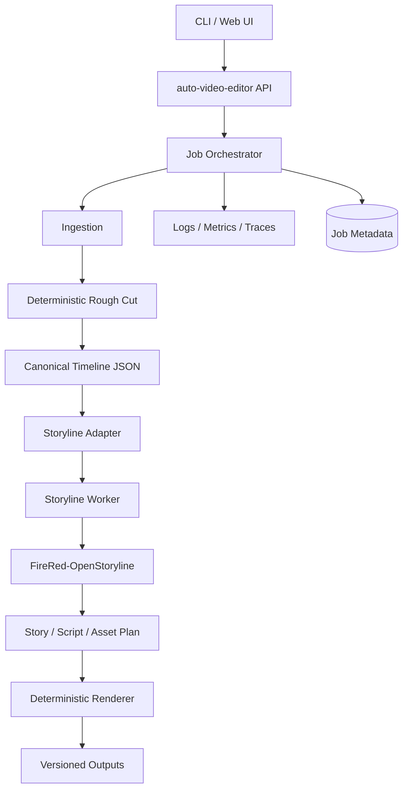

# FireRed-OpenStoryline 集成 auto-video-editor：设计评审与落地方案

> 评审日期：2026-09-17  
> 参考文档：`FireRed-OpenStoryline-Integration-Design.md`  
> 目标：把 FireRed-OpenStoryline 的语义创作能力集成到 `auto-video-editor`，形成可验证、可维护的自动视频编辑系统。

## 1. 结论

原设计的总体方向是合理的：

- `auto-video-editor` 负责确定性处理，例如导入、ASR、去静音、场景切分和导出。
- `FireRed-OpenStoryline` 负责语义理解、脚本、配乐、配音和自然语言精修。
- 两者通过明确的时间线数据契约连接。

但原设计不能直接作为实施方案。主要原因：

1. `auto-video-editor` 仓库当前无法通过公开网页验证，不能根据假设目录直接写集成代码。
2. 原文混用了“官方仓库”和 fork 地址，但实际代码版本、分支和提交没有锁定。
3. MCP、Python 直接导入、FastAPI 三种集成方式同时推进，范围过大。
4. 设计中引用了若干可能不存在的类、节点、工具名和 API。
5. 时间线、文件路径、任务状态、错误恢复和幂等性定义不足。
6. `moviepy`、`torch`、`torchaudio`、LLM SDK 等依赖存在较高冲突风险。

**推荐方案：先做单进程 Adapter MVP，再演进为独立 Storyline Worker。不要把 MCP 子进程作为第一阶段核心链路。**

## 2. 仓库事实与边界

### 2.1 FireRed-OpenStoryline

FireRed-OpenStoryline 的公开仓库提供 MCP、节点、Skills、Storage、Web/FastAPI、CLI 和资源目录。官方 README 说明其使用 Python 3.11 环境，依赖 FFmpeg，并通过 `config.toml` 配置 API Key。官方启动方式包括 MCP Server、CLI 和 FastAPI Web 服务。[web:2]

公开仓库当前没有发布 Release，最新公开提交页面显示为 2026-07-31。因此，集成时必须固定 Git commit，而不是只固定 `main` 分支。[web:2]

项目支持：

- 自然语言驱动的视频创作。
- 素材搜索、理解、脚本生成。
- 音乐、配音和字体推荐。
- 对话式调整。
- 可复用编辑 Skill。
- ASR 粗剪 Skill。
- 可选的 AI 转场。

AI 转场依赖第三方 AIGC 服务，成本和结果稳定性较差。应默认关闭。[web:2]

### 2.2 auto-video-editor

本次网页抓取无法读取以下两个 fork 仓库：

- `https://github.com/wayyet/FireRed-OpenStoryline`
- `https://github.com/wayyet/auto-video-editor`

因此，原设计中对 `auto-video-editor` 的目录、模块和 API 是推测，不是源码结论。下面的方案按“仓库待审计”处理。

集成前必须先确认：

- 实际入口：CLI、FastAPI 或其他服务。
- 当前 Python 版本和依赖锁文件。
- 粗剪输出格式。
- 是否已经使用 MoviePy、FFmpeg、Whisper 或 OTIO。
- 现有时间线数据结构。
- Windows、Linux、Docker 的运行目标。

## 3. 原设计评审

### 3.1 合理部分

| 设计点 | 评价 |
|---|---|
| 确定性引擎 + 智能 Agent | 合理。规则处理和 LLM 处理边界清晰。 |
| Adapter 适配层 | 必须保留。它可以隔离两个项目的内部变化。 |
| Timeline Bridge | 方向正确。集成的核心不是 prompt，而是时间线契约。 |
| 默认关闭 AI 转场 | 合理。可控制成本和不稳定因素。 |
| Skill 复用 | 有产品价值，可支持批量视频生产。 |
| 测试清单和分阶段路线图 | 方向正确，但需要补充验收指标。 |
| MCP 作为长期边界 | 合理。适合解耦和多客户端接入。 |

### 3.2 需要修正的部分

| 原设计 | 问题 | 修正建议 |
|---|---|---|
| `git submodule add` 官方仓库 | 没有锁定 fork、分支和 commit。 | 建立 fork 的固定 commit 或 vendored package。 |
| “方案 A 推荐”，同时“A+B 混合” | 第一阶段边界不清晰。 | MVP 只选 Direct Adapter；第二阶段再加入 Worker/MCP。 |
| `UnderstandingNode`、`ScriptNode` 等直接 import | 未确认真实导出路径和构造方式。 | 先读取源码和测试；只通过已验证的公共接口调用。 |
| `generate_storyline`、`conversational_refine` | 工具名称可能与实际 MCP tools 不一致。 | 启动 MCP 后调用 `list_tools`，以实际名称生成客户端。 |
| `from third_party.FireRed-OpenStoryline...` | Python import 路径包含连字符，语法无效。 | 使用 `PYTHONPATH`、可编辑安装或合法包名。 |
| `sys.path.append(...)` | 路径依赖当前工作目录，容易失效。 | 使用绝对路径解析、`pyproject.toml` 或 Worker。 |
| `ConfigLoader` 同时兼容 TOML + YAML | 增加配置复杂度和冲突来源。 | 统一 TOML 或统一 Pydantic Settings。 |
| `AgentMemory` 直接共享 | 可能带来并发、污染和隐私问题。 | MVP 使用 job-scoped 状态；持久化独立定义。 |
| EDL 作为主要交换格式 | EDL 对字幕、音频、效果和元数据表达不足。 | 使用内部 JSON 时间线，导出 EDL/OTIO 作为结果。 |
| 粗剪结果直接交给故事线 | 缺少原始时间映射和素材校验。 | 每个片段保存 source path、source range、timeline range、hash。 |
| FastAPI `app.mount` 合并两个应用 | 生命周期、路由、静态文件和鉴权可能冲突。 | 统一 API 层；不要直接挂载内部应用。 |
| Docker 安装阶段执行 `download.sh` | 构建会依赖网络和大模型资源，难以缓存。 | 代码镜像和模型/资源镜像分离。 |
| Windows 走 DirectClient | 不是充分的稳定性保证。 | Windows 也优先使用独立 Worker；验证 UTF-8、路径和进程退出。 |
| `final.mp4`、`skill.json` 直接覆盖 | 重试可能破坏旧结果。 | 使用 job ID、临时目录、原子提交。 |

## 4. 推荐目标架构

### 4.1 分阶段架构



### 4.2 推荐部署边界

**第一阶段：单进程 Adapter。**

适用于快速验证。Adapter 调用经过确认的 FireRed Python 接口。只允许在开发环境使用，必须有集成测试。

**第二阶段：Storyline Worker。**

`auto-video-editor` 通过 HTTP 或任务队列调用 FireRed Worker。Worker 独立管理模型、资源和渲染进程。生产环境推荐此方式。

**第三阶段：MCP。**

MCP 作为外部 Agent 或工具扩展接口，而不是内部视频生产链路的唯一协议。MCP 适合交互式调用，但不天然解决任务队列、超时、重试、权限和大文件传输。

## 5. 统一数据契约

不要让两个项目互相读取内部类。定义稳定的 JSON 契约。

### 5.1 Job 请求

```json
{
  "job_id": "job_20260917_0001",
  "input_media": [
    {
      "uri": "file:///data/raw/input.mp4",
      "sha256": "...",
      "duration_ms": 3600000
    }
  ],
  "intent": "生成一个幽默的小红书旅行视频",
  "style": "humorous",
  "language": "zh-CN",
  "options": {
    "enable_ai_transition": false,
    "enable_voiceover": true,
    "max_duration_ms": 60000
  }
}
```

### 5.2 时间线片段

```json
{
  "clip_id": "clip_0001",
  "source_media_id": "media_0001",
  "source_in_ms": 12000,
  "source_out_ms": 18500,
  "timeline_in_ms": 0,
  "timeline_out_ms": 6500,
  "transcript": "这里是原始转写文本",
  "words": [],
  "scene_id": "scene_03",
  "quality_score": 0.91,
  "semantic_tags": ["人物", "街景"],
  "content_hash": "..."
}
```

### 5.3 任务状态

```text
PENDING
RUNNING
WAITING_FOR_REVIEW
RENDERING
SUCCEEDED
FAILED
CANCELLED
```

每次状态变更保存：

- `job_id`。
- `step`。
- `attempt`。
- 开始和结束时间。
- 输入输出 artifact。
- 错误类型和可重试标记。

## 6. 代码组织建议

建议先不要把完整 FireRed 仓库放进 `src/`。使用外部 Worker 或明确的 integration package：

```text
auto-video-editor/
├── src/auto_video_editor/
│   ├── domain/
│   │   ├── timeline.py
│   │   ├── job.py
│   │   └── artifact.py
│   ├── pipeline/
│   │   ├── ingestion.py
│   │   ├── rough_cut.py
│   │   └── render.py
│   ├── integrations/
│   │   └── openstoryline/
│   │       ├── adapter.py
│   │       ├── client.py
│   │       ├── schemas.py
│   │       └── mapper.py
│   └── api/
├── contracts/
│   └── storyline_job.schema.json
├── tests/
│   ├── contract/
│   ├── integration/
│   └── e2e/
├── deployments/
│   └── docker-compose.yml
└── docs/
    └── integration.md
```

## 7. 关键实现原则

### 7.1 不直接依赖内部节点

推荐接口：

```python
class StorylineClient(Protocol):
    async def generate_plan(
        self,
        request: StorylineRequest,
    ) -> StorylinePlan:
        ...

    async def refine_plan(
        self,
        request: RefineRequest,
    ) -> StorylinePlan:
        ...
```

`StorylineClient` 可以有两个实现：

- `DirectStorylineClient`：本地开发和单进程测试。
- `HttpStorylineClient`：生产 Worker。

MCP 客户端不直接暴露给业务层，而是实现同一个接口。

### 7.2 时间统一使用整数毫秒

不要在跨进程 JSON 中混用 `float seconds`。统一使用整数毫秒，避免浮点误差。只在 FFmpeg 或第三方 API 边界转换为秒。

### 7.3 大文件不走 MCP 参数

视频、音频、图片只传 URI、artifact ID 或对象存储 key。MCP/HTTP 参数只传元数据。否则会造成内存占用、超时和重复传输。

### 7.4 LLM 只生成计划，不直接控制最终文件

LLM 输出结构化 `StorylinePlan`。确定性渲染器负责校验并执行：

- 时间范围不能越界。
- 片段不能引用不存在的素材。
- 音频轨不能产生非法重叠。
- 输出路径必须在 job 目录内。
- 外部资源必须经过权限和版权检查。

### 7.5 保持幂等

同一个 `job_id + input_hash + config_hash` 应产生可复用结果。渲染前写临时目录，成功后再原子改名：

```text
outputs/{job_id}/
├── manifest.json
├── timeline.json
├── preview.mp4
├── final.mp4
├── subtitles.srt
└── logs/
```

## 8. 安装与版本策略

公开 README 的安装方式要求 Python 3.11，并建议在项目配置 API Key 后启动 MCP、CLI 或 FastAPI。[web:2]

建议：

1. 不合并两个 `requirements.txt` 为一个无约束文件。
2. 为 FireRed 和主项目分别生成锁定依赖。
3. 固定 Python、FFmpeg、PyTorch、torchaudio 和 MoviePy 版本。
4. 固定 FireRed commit。
5. 使用容器或独立虚拟环境验证。
6. 模型和资源放在独立 volume，不在每次应用构建时下载。

示例：

```text
third_party/FireRed-OpenStoryline.commit
contracts/storyline_job.schema.json
uv.lock 或 requirements.lock
```

如果使用 Git submodule，命令应明确使用 fork 和固定 commit：

```bash
git submodule add https://github.com/wayyet/FireRed-OpenStoryline.git third_party/FireRed-OpenStoryline
git -C third_party/FireRed-OpenStoryline checkout <KNOWN_GOOD_COMMIT>
git add .gitmodules third_party/FireRed-OpenStoryline
git commit -m "build: pin FireRed OpenStoryline integration version"
```

`<KNOWN_GOOD_COMMIT>` 必须替换为真实、已通过测试的 commit，不能直接复制执行。

## 9. 验证计划

### 9.1 必须补充的测试

| 测试层级 | 验证内容 | 通过标准 |
|---|---|---|
| Contract | 请求、时间线、计划 JSON | schema 校验通过 |
| Unit | 时间映射、场景分组、配置 | 边界用例全部通过 |
| Integration | Adapter/Worker 调用 | 错误可分类，结果可解析 |
| Rendering | FFmpeg/MoviePy 输出 | 视频可播放，音画同步 |
| E2E | 原始视频到最终视频 | 输出清单完整 |
| Retry | 任务失败后重试 | 不重复污染结果 |
| Cancel | 用户取消任务 | 子进程和 GPU 任务被回收 |
| Security | 路径、上传、API Key | 无路径穿越和密钥泄漏 |
| License | 字体、音乐、素材 | 资源清单可追溯 |

### 9.2 质量指标

建议记录以下指标，而不是只验证“生成了 MP4”：

- 粗剪保留率。
- 字幕时间偏差。
- 音画同步偏差。
- 渲染失败率。
- 单分钟视频成本。
- 单任务耗时。
- LLM 调用次数和 token 数。
- 用户重新生成次数。
- Skill 复用成功率。

## 10. 优点与缺点

### 10.1 预期优点

- 确定性剪辑和生成式能力分层，便于定位问题。
- 保留已有粗剪能力，迁移成本低。
- 自然语言可以降低复杂编辑操作的门槛。
- Skill 可以沉淀可复用的视频生产流程。
- 独立 Worker 可以隔离模型依赖和 GPU 资源。
- 结构化时间线便于接入 OTIO、EDL、字幕和多种导出器。

### 10.2 主要缺点

- LLM 输出具有不确定性，需要校验和人工确认。
- 依赖模型、API Key、FFmpeg 和大体积资源。
- 多进程或多服务会增加部署、日志和故障排查成本。
- 视频渲染耗时长，不能简单按普通 HTTP 请求处理。
- 素材、字体、音乐和生成内容存在版权风险。
- Skill 版本升级可能导致旧模板行为变化。
- 直接合并两个 Python 依赖环境，容易出现运行时冲突。

## 11. 分阶段实施计划

### Phase 0：源码审计

- 获取两个仓库的可访问源码。
- 记录 commit、Python 版本、依赖和入口。
- 运行两个项目原始测试和最小 Demo。
- 确认 FireRed 实际 MCP tools 和 Python API。

### Phase 1：契约和 Adapter

- 定义 `timeline.json`、`StorylineRequest`、`StorylinePlan`。
- 实现时间单位、路径和 artifact 校验。
- 用固定样例视频完成粗剪到计划生成。
- 暂不接 AI 转场和批量 Skill。

### Phase 2：Worker 化

- FireRed 单独服务化。
- 增加 job 状态、超时、取消、重试和日志。
- 使用共享 volume 或对象存储传递视频资源。
- 加入 CPU/GPU 资源限制。

### Phase 3：交互和 Skill

- 增加 `refine_plan`。
- 对每次修改保存版本和 diff。
- Skill 使用 schema、版本号和兼容性检查。
- 增加人工审核状态 `WAITING_FOR_REVIEW`。

### Phase 4：产品化

- Web 时间线和对话面板统一。
- 增加指标、Tracing、审计日志。
- 完成版权、隐私和 API Key 管理。
- 再评估是否将 MCP 作为外部扩展接口。

## 12. 最终建议

1. **接受总体架构方向。** Adapter、结构化时间线、确定性渲染和 Skill 都值得保留。
2. **拒绝直接按原文开工。** 原文有多个未经源码验证的类名、工具名、目录和 API。
3. **第一阶段采用 Direct Adapter。** 先完成最小闭环，减少协议和部署变量。
4. **生产采用 Storyline Worker。** 用 HTTP 或任务队列连接，不把视频大文件放进 MCP 参数。
5. **将 MCP 定位为扩展接口。** 它适合 Agent 工具调用，不应替代任务系统和 artifact 管理。
6. **所有版本、资源和输出必须可追溯。** 固定 commit，保存 manifest，使用 job ID 和内容 hash。

一句话：`auto-video-editor` 负责可靠地处理媒体，FireRed-OpenStoryline 负责理解意图并生成编辑计划；两者之间必须用稳定的数据契约连接，而不是直接互相 import 内部实现。
