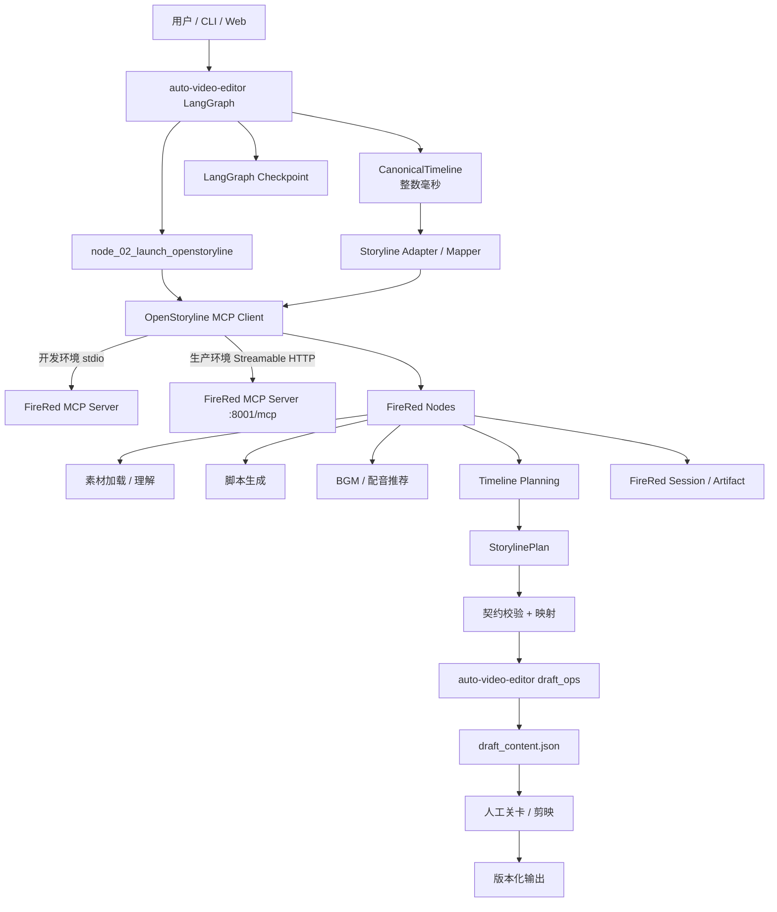
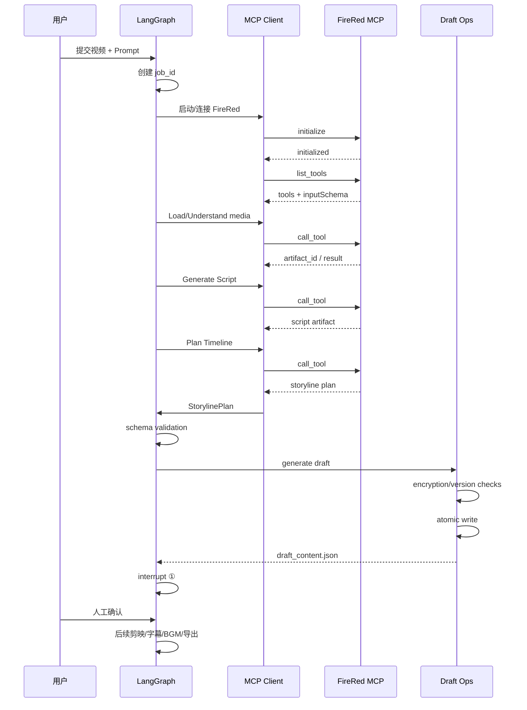

# FireRed-OpenStoryline 嵌入 auto-video-editor：集成综合评审与落地方案

**评审日期：** 2026-09-17  
**目标：** 将 `wayyet/FireRed-OpenStoryline` 集成到 `wayyet/auto-video-editor`，并把现有 6 份集成文档中合理的设计合并为一套可实施方案。  
**核验方式：** 对两个 GitHub 仓库当前 `main` 公开源码、README、配置和既有集成代码进行静态源码核验。  
**重要限制：** 本次无法在当前环境直接拉取两个仓库并启动服务，因此运行时 MCP 握手、实际 `list_tools()` 返回值、工具 JSON Schema、真实 Windows 依赖安装结果尚未执行；凡属于这些范围的内容，本文均标记为“需要运行时验证”，不把设计假设写成源码事实。

---

## 1. 最终结论

### 1.1 推荐的最终集成路线

**推荐：MCP-first + 进程隔离 + Canonical Timeline 契约 + LangGraph 负责业务编排。**

不要采用“直接把 FireRed Python 包 import 进 auto-video-editor 主进程”的生产方案，也不要把 FireRed 的 `agent_fastapi.py` 当成默认的生产集成 API。

目标结构：



### 1.2 最重要的事实修正

当前 FireRed 仓库的 MCP 服务入口是：

```powershell
$env:PYTHONPATH="src"
python -m open_storyline.mcp.server
```

README 当前给出的 MCP 配置是 `127.0.0.1:8001/mcp`，transport 为 `streamable-http`。FireRed 的 Web 对话入口 `agent_fastapi.py` 与 MCP 服务不是同一个接口；README 的 Web 示例当前使用 `7860`。因此，现有文档中“生产 Worker = FastAPI 8005”的说法不能直接采用。

### 1.3 现有 auto-video-editor 并不是传统 VAD/SceneDetect 粗剪器

当前仓库的核心是 LangGraph 编排的剪映草稿自动化工作流，存在：

- `graph.py`：13+1 节点工作流、条件边、并行分支、`interrupt/resume`。
- `state.py`：持久化工作流状态、日志 reducer、字幕和封面等结构。
- `draft_ops/`：草稿加密检测、版本策略、原子写入。
- `mcp_clients/openstoryline_client.py`：OpenStoryline MCP 客户端接口骨架。
- `nodes/node_02_launch_openstoryline.py`：启动 OpenStoryline 服务的现有入口。
- `nodes/node_04_import_and_plan.py`：通过 MCP 获取 `shot_plan`。
- `nodes/node_05_generate_draft.py`：将 `shot_plan` 转换为剪映草稿。

因此，真正的集成不是“给一个粗剪器增加 FireRed”，而是：

> **让 FireRed 成为语义理解与故事线规划引擎，让 auto-video-editor 继续成为业务级工作流、人工关卡、剪映草稿和最终交付的主编排器。**

---

# 2. 六份文档逐份评审

## 2.1 `FireRed-OpenStoryline-Integration-Design.md`

### 原设计核心思路

这份文档提出：

1. auto-video-editor 做确定性视频处理。
2. FireRed 做语义理解、脚本、BGM、配音和对话式精修。
3. 用时间线作为两个系统之间的桥梁。
4. 用 Direct Adapter、MCP、HTTP/FastAPI 等方案完成接入。
5. 甚至提出把 FireRed 作为“智能大脑”嵌入主项目。

### 合理部分

| 设计点 | 评价 |
|---|---|
| 确定性逻辑与 LLM 逻辑分离 | 保留 |
| Adapter 隔离内部实现 | 保留 |
| Timeline / JSON 契约 | 强烈保留 |
| LLM 输出计划，确定性系统执行 | 强烈保留 |
| 大文件不要直接进入 MCP 参数 | 保留 |
| AI 转场默认关闭 | 保留 |
| Skill 复用 | 保留 |

### 必须修正

| 原设计 | 问题 | 最终修正 |
|---|---|---|
| 把 auto-video-editor 当成 VAD/SceneDetect 粗剪引擎 | 与当前代码事实不符 | 以 LangGraph + 剪映草稿工作流为主 |
| Direct import 为主要路线 | 会把两个系统的 Python 依赖绑在一起 | 生产采用 MCP 进程隔离 |
| 直接 import `ScriptNode` / `BGMNode` 等类 | 未经过当前源码验证 | 通过 MCP `list_tools()` + JSON Schema 运行时发现 |
| 使用 EDL/OTIO 作为核心交换格式 | 与剪映草稿主流程不匹配 | 内部使用 CanonicalTimeline，最终落到 `draft_content.json` |
| FastAPI 直接 `app.mount` | 生命周期、路由和鉴权容易耦合 | MCP 服务独立，主项目保持自己的 API 层 |
| 统一 requirements | 依赖体量大，风险高 | 两套环境、两套依赖锁 |

**结论：保留架构思想，不直接使用其代码骨架。**

---

## 2.2 `FireRed-OpenStoryline-auto-video-editor-集成评审.md`

### 合理部分

这份文档已经识别出了多个关键工程问题：

- 版本必须锁定。
- 不能直接 import 未验证的内部类。
- 不能同时推进 Direct + MCP + FastAPI 三条主路线。
- 需要统一时间线契约。
- 需要 job-scoped 状态。
- 需要幂等输出。
- 大文件不能通过 MCP 参数直接传输。
- AI 转场默认关闭。

这些全部保留。

### 需要修正

最初评审里有一个核心判断是“两个仓库无法通过公开网页验证”。当前已经不成立。两个仓库现在均可通过 GitHub 公共页面访问，并能直接核验源码结构。

另外，这份文档推荐的“第一阶段 Direct Adapter”也需要下调到“实验性内部测试方案”。真正集成路线应优先利用 auto-video-editor 已经存在的 MCP 客户端骨架，而不是重新绕开它。

**结论：方法论正确，仓库事实部分需要更新。**

---

## 2.3 `FireRed-OpenStoryline 集成 auto-video-ed.md`

这份文档已经做了一个重要的简化：

> 第一阶段本地 Adapter，第二阶段 Worker；MCP 不作为唯一内部控制协议。

### 保留

- Adapter 思想。
- Storyline Worker 演进方向。
- Canonical Timeline。
- URI / artifact ID 传输大文件。
- LLM 只生成计划，确定性系统校验和执行。

### 调整

“Direct Adapter → Worker”不应作为当前项目的唯一演进顺序。

原因不是 Direct Adapter 在任何情况下都不可用，而是当前 auto-video-editor 已经存在 MCP 入口，而且 FireRed 本身已经把核心节点包装成 MCP tools。继续以 Direct Adapter 作为第一主路线，会产生另一套集成通道，增加维护面。

最终改为：

```text
MCP Client Protocol
       ↓
开发期 stdio
       ↓
生产期 Streamable HTTP
       ↓
必要时再增加独立 Job Worker
```

---

## 2.4 `FireRed-OpenStoryline 嵌入 auto-video-editor：集成评审与落地方案 v2.0.md`

这份文档比前面三份更接近目标架构，但仍有几个问题。

### 合理

- MCP-first。
- 进程隔离。
- Canonical Timeline。
- `list_tools()` 动态发现。
- 版本锁定。
- 幂等输出。
- 输出目录按 `job_id` 隔离。

### 关键修正

#### ① “FireRed 3.11 vs auto 3.13 是硬冲突”不宜直接写成绝对事实

FireRed README 推荐 Python `>=3.11`，auto-video-editor 当前 README 声明 Python `3.13.11` 实测通过，且 `pyproject.toml` 的 `requires-python` 是 `>=3.10`。

因此更严谨的结论是：

> **两个项目已经存在不同的已验证运行环境和依赖基线，生产环境应该隔离；不应在尚未完成依赖矩阵测试前假设两个环境可以安全合并。**

这比直接写“Python 3.11 与 3.13 必然冲突”更准确。

#### ② `8005` 不是当前 FireRed MCP 服务端口

当前 FireRed `config.toml`：

```toml
[local_mcp_server]
server_transport = "streamable-http"
connect_host = "127.0.0.1"
port = 8001
path = "/mcp"
```

所以：

```text
MCP = http://127.0.0.1:8001/mcp
```

不能继续使用：

```text
HTTP Worker = 8005
```

作为“当前源码事实”。

#### ③ FireRed Web FastAPI 不是 MCP Worker

`agent_fastapi.py` 是 FireRed 的对话/Web 入口。

它可以作为人工交互界面，但不应该成为 `auto-video-editor -> FireRed` 的核心机器对机器协议。

---

## 2.5 `(最终修正版)doubao.md`

这份文档的总体判断已经转向 MCP-first，方向正确。

### 保留

- MCP-first。
- 双环境隔离。
- `list_tools()` 动态发现。
- 三层契约：Canonical JSON → MCP payload → `draft_content.json`。
- `job_id` 输出隔离。
- 原子写入。
- 默认关闭 AI Transition。

### 修正

它继承了“FastAPI 8005 生产路径”的问题。

因此最终采用：

```text
开发：MCP stdio
生产：FireRed 原生 Streamable HTTP MCP :8001/mcp
长期高并发：再在 MCP 上方加 Job Gateway / Worker
```

而不是：

```text
开发：stdio
生产：FastAPI :8005
```

---

## 2.6 `(最终修正版).md`

这份文档是目前最接近可以实施的版本，但仍然应该再修正以下问题：

1. 不把 Python 3.11/3.13 直接写成“必然硬冲突”。
2. 不把 8005 当成 FireRed 当前 MCP Worker 端口。
3. 不假设 `load_media / understand_clips / plan_timeline` 等工具名一定就是实际 MCP tool name。
4. `list_tools()` 的运行时发现是正确思想，但需要同时读取工具的 `inputSchema`，不能只检查名称。
5. FireRed 的工具包装层要求 `artifact_id` 和 `session_id`，Adapter 必须负责这些上下文的生成和绑定。
6. “FireRed -> Plan -> draft”应当是第一条稳定主链；不要一开始让 FireRed `RenderVideoNode` 接管 auto-video-editor 的最终渲染所有权。

---

# 3. 当前两个仓库的真实边界

## 3.1 FireRed-OpenStoryline

当前仓库存在：

```text
src/open_storyline/
├── mcp/
├── nodes/
├── skills/
├── storage/
├── utils/
├── agent.py
└── config.py
```

README 还明确列出了：

- 智能素材搜索。
- 镜头理解。
- 脚本生成。
- BGM 推荐。
- 配音。
- Timeline Planning。
- AI Transition。
- Skill。
- MCP。
- Agent Memory / Storage。

当前 MCP `available_nodes` 配置包括：

```text
LoadMediaNode
SearchMediaNode
SearchWebTopicNode
SplitShotsNode
LocalASRNode
SpeechRoughCutNode
GenerateAITransitionNode
UnderstandClipsNode
FilterClipsNode
GroupClipsNode
GenerateScriptNode
ScriptTemplateRecomendation
GenerateVoiceoverNode
SelectBGMNode
RecommendTransitionNode
RecommendTextNode
PlanTimelineProNode
PlanTimelineAITransitionNode
RenderVideoNode
```

但是 MCP 对外暴露的最终 tool name 由 Node 元数据生成。因此集成客户端不应把上面的类名直接当成 tool name。

---

## 3.2 auto-video-editor

当前主图已经包含：

```text
START
 -> clean_cache
 -> launch_openstoryline
 -> open_preview
 -> import_and_plan
 -> generate_draft
 -> human_reorder [interrupt ①]
 -> speed_fit [conditional retry]
 -> add_subtitles
 -> inject_fx
 -> inject_text_fx
 -> inject_sticker
 -> human_add_bgm [interrupt ②]
 -> adjust_volume
 -> make_covers
 -> localize_covers_en
 -> translate_and_check
 -> layout_review [conditional interrupt ③]
 -> english_tts
 -> join_before_delivery
 -> END
```

因此 FireRed 集成位置不应该再造一条新的总工作流，而是插入现有 LangGraph。

---

# 4. 最终职责划分

| 能力 | auto-video-editor | FireRed | 最终归属 |
|---|---|---|---|
| Job 生命周期 | ✅ | ❌ | auto |
| LangGraph 编排 | ✅ | ❌ | auto |
| Human interrupt/resume | ✅ | 可提供能力 | auto |
| 剪映草稿 | ✅ | 可生成/渲染 | auto 为系统主账 |
| 草稿加密检测 | ✅ | ❌ | auto |
| 原子写入 | ✅ | ❌ | auto |
| 素材搜索 | 可扩展 | ✅ | FireRed |
| 视觉理解 | 可接 | ✅ | FireRed |
| 脚本生成 | 可接 | ✅ | FireRed |
| BGM 推荐 | 可接 | ✅ | FireRed |
| 配音 | 可接 | ✅ | FireRed |
| 语义 Timeline Planning | ❌ | ✅ | FireRed |
| 最终剪映落盘 | ✅ | ❌ | auto |
| Skill 语义沉淀 | 可接 | ✅ | FireRed |
| 最终成片所有权 | ✅ | 可提供渲染 | auto |

核心原则：

> **FireRed 负责“理解、决策、规划”；auto-video-editor 负责“状态、人工确认、落盘、交付”。**

---

# 5. 最终集成架构

## 5.1 开发环境

推荐先使用 MCP stdio。

```text
LangGraph node_02
      |
      v
启动独立 Python 进程
      |
      +-- FireRed Python 3.11 环境
      |
      +-- PYTHONPATH=FireRed/src
      |
      +-- python -m open_storyline.mcp.server
      |
      v
MCP stdio session
      |
      +-- initialize
      +-- list_tools
      +-- tool inputSchema
      +-- call_tool
```

优点：

- 不需要假设 HTTP health API。
- 不需要额外 FastAPI wrapper。
- 进程退出容易监控。
- Windows 本地开发更加直接。
- 两个 Python 环境隔离。

## 5.2 生产环境

优先使用 FireRed 自己的 Streamable HTTP MCP：

```text
http://127.0.0.1:8001/mcp
```

生产链：

```text
auto-video-editor
        |
        v
OpenStorylineMCPClient
        |
        | HTTP
        v
FireRed MCP Server
        |
        +-- SessionLifecycleManager
        +-- ArtifactStore
        +-- Node Registry
        +-- LLM/VLM
        +-- video tools
```

这样可以避免把 FireRed 内部 FastAPI 应用嵌入主服务。

---

# 6. 现有代码需要怎样改

## 6.1 `config.py`

当前代码：

```python
OPENSTORYLINE_CMD = [
    "python", "-m", "openstoryline.server",
]

OPENSTORYLINE_MCP_PORT = 8006
OPENSTORYLINE_WEB_PORT = 8005
```

其中 `openstoryline.server` 与当前 FireRed README 的真实 MCP 入口不一致。

建议修改成配置驱动：

```python
from pathlib import Path

FIRERED_ROOT = Path(r"E:\Documents\kuaishou\FireRed-OpenStoryline")
FIRERED_PYTHON = Path(r"C:\Users\YOUR_USER\miniforge3\envs\storyline\python.exe")

OPENSTORYLINE_CMD = [
    str(FIRERED_PYTHON),
    "-m",
    "open_storyline.mcp.server",
]

OPENSTORYLINE_MCP_PORT = 8001
OPENSTORYLINE_MCP_PATH = "/mcp"
OPENSTORYLINE_WEB_PORT = 7860
```

实际项目中不要硬编码用户目录。推荐从 `.env` / `config.py` 注入：

```text
FIRERED_ROOT
FIRERED_PYTHON
FIRERED_MCP_URL
```

同时使用：

```python
env = os.environ.copy()
env["PYTHONPATH"] = str(FIRERED_ROOT / "src")
```

并且建议把 FireRed 进程的 `cwd` 设置为 FireRed 根目录，使 `config.toml`、`.storyline`、`resource` 等相对路径稳定。

---

## 6.2 `node_02_launch_openstoryline.py`

当前节点做了：

1. `subprocess.Popen()`。
2. 设置 PID。
3. 用 Web URL health check。

问题：当前 health check 依赖 `OPENSTORYLINE_WEB_PORT`，不能证明 MCP server 真正可用。

### 最终设计

把“服务就绪”定义为：

```text
进程存在
    AND
MCP initialize 成功
    AND
list_tools 成功
    AND
必需能力工具存在
```

即：

```python
ready = await mcp_client.probe()
```

不要只判断：

```python
GET http://127.0.0.1:8005
```

---

# 7. MCP Client 最终接口

`mcp_clients/openstoryline_client.py` 当前仍然是骨架和 Mock，应升级成真正的协议适配层。

推荐接口：

```python
from typing import Protocol, Any


class StorylineClient(Protocol):
    async def connect(self) -> None:
        ...

    async def close(self) -> None:
        ...

    async def discover_tools(self) -> dict[str, Any]:
        ...

    async def call_capability(
        self,
        capability: str,
        arguments: dict[str, Any],
    ) -> dict[str, Any]:
        ...

    async def build_storyline_plan(
        self,
        request: dict[str, Any],
    ) -> dict[str, Any]:
        ...

    async def read_artifact(
        self,
        artifact_id: str,
    ) -> dict[str, Any]:
        ...
```

不要把 FireRed 的具体 Node Class 暴露到 `auto-video-editor` 的业务层。

正确关系：

```text
auto-video-editor domain
        |
        v
StorylineClient
        |
        +-- StdioStorylineClient
        |
        +-- StreamableHttpStorylineClient
        |
        +-- MockStorylineClient
```

---

# 8. 为什么必须 `list_tools()` + `inputSchema`

FireRed 当前 `register_tools.py` 会从 Node Registry 中扫描节点，并根据 Node 元数据动态注册 MCP Tool。

因此不能直接写：

```python
await session.call_tool("generate_storyline", ...)
```

因为这个名字并没有被当前源码证明。

应采用：

```python
result = await session.list_tools()
```

然后建立：

```text
semantic capability
        |
        v
candidate tools
        |
        v
inputSchema validation
        |
        v
runtime-selected tool
```

例如：

```python
CAPABILITY_ALIASES = {
    "load_media": [
        "load_media",
        "LoadMediaNode",
    ],
    "understand_clips": [
        "understand_clips",
        "UnderstandClipsNode",
    ],
    "plan_timeline": [
        "plan_timeline_pro",
        "PlanTimelineProNode",
    ],
}
```

注意：以上只是候选映射，不应直接视为当前真实 tool name。必须在真实 MCP session 中通过 `list_tools()` 验证后固定版本。

---

# 9. Session 与 Artifact 设计

FireRed MCP wrapper 当前使用：

```text
X-Storyline-Session-Id
artifact_id
NodeState
ArtifactStore
read_node_history
```

因此集成后应把一个 auto-video-editor `job_id` 映射成一个 FireRed session。

推荐：

```text
job_id
  |
  +-- storyline_session_id
  |
  +-- canonical_timeline.json
  |
  +-- storyline_plan.json
  |
  +-- artifact manifest
  |
  +-- draft_content.json
```

映射示例：

```json
{
  "job_id": "job_20260917_0001",
  "storyline_session_id": "job_20260917_0001-storyline",
  "source_media": [],
  "artifacts": []
}
```

这样可以保证：

- LangGraph checkpoint 管业务状态。
- FireRed session 管语义执行上下文。
- `artifact_id` 管 FireRed 节点结果。
- 两边不会直接共享内部 Python 对象。

---

# 10. CanonicalTimeline：最终建议

它仍然应该存在，但需要严格定位：

> **CanonicalTimeline 是 auto-video-editor 的领域数据契约，不是 FireRed 内部对象。**

推荐最小结构：

```json
{
  "schema_version": "1.0",
  "job_id": "job_20260917_0001",
  "source_media": [
    {
      "media_id": "media-001",
      "file_uri": "file:///E:/video/input.mp4",
      "sha256": "...",
      "duration_ms": 3600000
    }
  ],
  "clips": [
    {
      "clip_id": "clip-001",
      "source_media_id": "media-001",
      "source_in_ms": 12000,
      "source_out_ms": 18500,
      "timeline_in_ms": 0,
      "timeline_out_ms": 6500,
      "transcript": "这里是字幕内容",
      "semantic_tags": ["人物", "旅行", "街景"]
    }
  ],
  "language": "zh-CN",
  "intent": "旅行 Vlog，轻松自然",
  "options": {
    "enable_ai_transition": false,
    "enable_voiceover": true,
    "max_duration_ms": 60000
  }
}
```

### 时间单位

跨进程统一使用：

```text
integer milliseconds
```

只在 FFmpeg / FireRed 第三方参数边界转换成秒。

### 为什么不用 float seconds

避免：

```text
5.999999
6.000001
```

这种浮点误差在剪辑边界累计后产生音画不同步。

---

# 11. 三层数据映射

最终采用：

```text
Layer 1
CanonicalTimeline
        |
        v
Layer 2
FireRed MCP Payload
        |
        v
Layer 3
Jianying draft_content.json
```

不能让 FireRed 直接读写：

```text
auto-video-editor/state.py
```

也不能让 auto-video-editor 直接依赖：

```text
FireRed NodeState
ArtifactStore 内部对象
```

这样才能做到版本独立升级。

---

# 12. 最终业务流程



---

# 13. AI 转场的最终策略

FireRed 当前明确提供 AI Transition，但 README 同时指出它依赖第三方 AIGC 视频生成能力，存在成本和结果随机性。

最终配置：

```toml
enable_ai_transition = false
```

第一阶段不进入主链。

只有：

```text
用户显式开启
        ↓
单独节点
        ↓
生成结果校验
        ↓
成功才合并
```

不能让 AI Transition 失败导致基础剪辑链失败。

---

# 14. RenderVideoNode 的归属

FireRed 当前有 `RenderVideoNode`。

但在第一阶段，不建议直接把它作为最终交付渲染器。

原因：当前 auto-video-editor 的主流程已经围绕剪映草稿、人工关卡、`draft_ops` 和最终交付构建。

推荐：

```text
FireRed
    ↓
Semantic Plan
    ↓
auto-video-editor Mapper
    ↓
draft_content.json
    ↓
剪映 / 既有交付链
```

第二阶段再评估：

```text
FireRed RenderVideoNode
```

能否作为一个旁路渲染器，承担无人工参与场景。

也就是说：

> **不要在第一次集成时同时切换“故事线引擎”和“最终渲染引擎”。**

---

# 15. 幂等性与重试

每个 Job 使用：

```text
outputs/{job_id}/
```

建议结构：

```text
outputs/
└── job_20260917_0001/
    ├── manifest.json
    ├── input_manifest.json
    ├── canonical_timeline.json
    ├── storyline_request.json
    ├── storyline_plan.json
    ├── draft_content.json
    ├── checkpoints/
    ├── artifacts/
    ├── logs/
    └── final/
```

重试不得覆盖旧版本。

采用：

```text
artifact_id + version + sha256
```

进行结果标识。

状态流：

```text
CREATED
  -> RUNNING
  -> WAITING_HUMAN
  -> RESUMABLE
  -> COMPLETED
```

异常：

```text
RUNNING
  -> FAILED_RETRYABLE
  -> RETRYING
  -> COMPLETED
```

或：

```text
FAILED_RETRYABLE
  -> FAILED_FINAL
```

---

# 16. 依赖隔离策略

## 16.1 不合并 requirements

禁止：

```text
FireRed requirements.txt
        +
auto-video-editor requirements.txt
```

直接合成一个环境。

推荐：

```text
.venv-auto
    |
    +-- LangGraph
    +-- PostgreSQL checkpoint
    +-- auto-video-editor dependencies

storyline environment
    |
    +-- FireRed
    +-- MoviePy
    +-- torch / torchaudio（按实际功能）
    +-- MCP server
```

## 16.2 Windows 进程启动

建议显式配置 FireRed Python：

```text
FIRERED_PYTHON=C:\...\envs\storyline\python.exe
```

不要依赖：

```text
python
```

因为 `PATH` 在 Windows 多环境下非常容易导致错误 Python 被启动。

---

# 17. 当前 auto-video-editor 的已有代码应该怎么复用

## 保留

```text
graph.py
state.py
nodes/node_02_launch_openstoryline.py
nodes/node_04_import_and_plan.py
nodes/node_05_generate_draft.py
mcp_clients/openstoryline_client.py
draft_ops/
monitoring/
tests/
```

## 改造

### `node_02_launch_openstoryline.py`

从：

```text
启动进程 + Web health check
```

改成：

```text
启动进程
  -> MCP initialize
  -> list_tools
  -> capability check
  -> ready
```

### `mcp_clients/openstoryline_client.py`

从：

```text
Mock + JSON HTTP skeleton
```

升级成：

```text
Protocol Adapter
├── stdio
├── streamable-http
├── runtime tool discovery
├── inputSchema validation
├── timeout
├── retry
├── session id
├── artifact id
└── error normalization
```

### `node_04_import_and_plan.py`

从：

```text
import_video_and_get_shot_plan()
```

升级为：

```text
CanonicalTimeline
      ↓
Storyline capability
      ↓
StorylinePlan
      ↓
state["storyline_plan"]
```

### `node_05_generate_draft.py`

保留现有 `draft_ops`。

只把输入从：

```text
shot_plan
```

扩展成：

```text
validated storyline plan
```

---

# 18. `WorkflowState` 建议增加的字段

建议：

```python
class WorkflowState(TypedDict, total=False):
    job_id: str
    storyline_session_id: str
    storyline_ready: bool
    storyline_transport: str
    storyline_mcp_endpoint: str | None
    storyline_tools: dict

    canonical_timeline_path: str | None
    storyline_request_path: str | None
    storyline_plan_path: str | None

    storyline_artifact_ids: list[str]
    storyline_error: str | None
```

不要把整个 FireRed 内部 `NodeState` 写进 LangGraph state。

只存：

```text
URI
ID
hash
version
summary
```

这样 checkpoint 才不会变成巨大对象。

---

# 19. 错误处理

推荐把错误分为 5 类：

| 类型 | 示例 | 行为 |
|---|---|---|
| PROCESS_START_FAILED | FireRed 进程启动失败 | retry / fail |
| MCP_CONNECT_FAILED | initialize 失败 | retry |
| TOOL_NOT_FOUND | 必需 capability 不存在 | fail-fast |
| TOOL_EXECUTION_FAILED | FireRed node 执行失败 | retry |
| CONTRACT_INVALID | 返回 JSON 不符合 Schema | fail-fast + artifact 留存 |

禁止所有异常统一：

```python
except Exception:
    return {}
```

必须保留：

```text
job_id
session_id
tool_name
artifact_id
error_code
retry_count
```

便于定位。

---

# 20. 超时策略

不要使用一个统一超时值。

建议：

```text
MCP connect timeout        10s
list_tools timeout         10s
LLM planning              120-300s
VLM understand            120-300s
voice generation          300s+
video generation          600s+
```

这些数值是初始工程配置，不是 FireRed 当前代码的既定事实。真实值应通过运行测试确定。

尤其是：

```text
LLM timeout
!=
HTTP client timeout
!=
整个 Job timeout
```

Job timeout 应由 LangGraph/Orchestrator 控制。

---

# 21. 测试方案

## Phase 1：协议测试

必须验证：

```text
TC-01 FireRed process starts
TC-02 MCP initialize succeeds
TC-03 list_tools succeeds
TC-04 all required capabilities discoverable
TC-05 missing capability produces clear error
TC-06 session id survives multiple calls
TC-07 artifact id can be read back
```

## Phase 2：契约测试

```text
TC-08 CanonicalTimeline schema valid
TC-09 invalid source range rejected
TC-10 missing media rejected
TC-11 timeline overlap detected
TC-12 StorylinePlan -> draft mapping stable
```

## Phase 3：工作流测试

```text
TC-13 graph reaches node_04
TC-14 Storyline failure can retry
TC-15 interrupt ① can resume
TC-16 restart process can resume job
TC-17 same job retry does not overwrite previous output
```

## Phase 4：E2E

```text
input.mp4
   -> FireRed understanding
   -> script
   -> plan
   -> CanonicalTimeline
   -> draft_content.json
   -> human interrupt
   -> final delivery
```

---

# 22. 验收指标

建议至少设置：

| 指标 | 目标 |
|---|---:|
| MCP 初始化成功率 | >= 99% |
| `list_tools` 成功率 | >= 99% |
| Storyline Plan Schema 合法率 | 100% |
| Job 重试无覆盖 | 100% |
| Checkpoint Resume 成功率 | >= 99% |
| 时间线非法引用 | 0 |
| source range 越界 | 0 |
| 未知 tool 直接调用 | 0 |
| Secret 泄露到日志 | 0 |

音画同步指标建议在真实剪辑链稳定后单独做基准，不宜在当前文档中直接承诺固定毫秒值。

---

# 23. 分阶段实施计划

## Phase A：修复现有 OpenStoryline 接入层

修改：

```text
config.py
node_02_launch_openstoryline.py
mcp_clients/openstoryline_client.py
```

目标：

```text
启动真实 FireRed MCP
        ↓
initialize
        ↓
list_tools
        ↓
真实 tool call
```

不要立刻修改 13+1 主图。

---

## Phase B：建立 Canonical Timeline

新增：

```text
contracts/
    canonical_timeline.schema.json
    storyline_plan.schema.json

integrations/openstoryline/
    adapter.py
    mapper.py
    validators.py
```

先做到：

```text
真实 FireRed result
   ↓
CanonicalTimeline / StorylinePlan
   ↓
JSON Schema
```

---

## Phase C：接入 node_04 / node_05

改造：

```text
node_04_import_and_plan.py
node_05_generate_draft.py
```

目标：

```text
FireRed semantic plan
        ↓
Canonical mapper
        ↓
draft_content.json
```

---

## Phase D：与 interrupt/resume 联调

重点验证：

```text
FireRed 完成
   ↓
LangGraph checkpoint
   ↓
interrupt ①
   ↓
第二天 resume
   ↓
继续剪辑
```

必须确保 FireRed session/artifact 不因主流程暂停而丢失。

---

## Phase E：生产化

增加：

```text
Streamable HTTP
health/probe
metrics
structured logging
job timeout
retry policy
artifact cleanup
version pin
```

长期高并发再考虑：

```text
Job Gateway
    ↓
FireRed Worker Pool
```

---

# 24. 最终目录建议

推荐在 `auto-video-editor` 中逐步增加：

```text
auto-video-editor/
├── contracts/
│   ├── canonical_timeline.schema.json
│   └── storyline_plan.schema.json
│
├── integrations/
│   └── openstoryline/
│       ├── adapter.py
│       ├── client.py
│       ├── mapper.py
│       ├── schemas.py
│       ├── capabilities.py
│       └── validators.py
│
├── mcp_clients/
│   └── openstoryline_client.py
│
├── nodes/
│   ├── node_02_launch_openstoryline.py
│   ├── node_04_import_and_plan.py
│   └── node_05_generate_draft.py
│
├── draft_ops/
├── monitoring/
├── tests/
│   ├── contract/
│   ├── integration/
│   └── e2e/
└── docs/
    └── FireRed-OpenStoryline-integration.md
```

不推荐：

```text
third_party/FireRed-OpenStoryline/src/...
```

作为业务代码直接 import 的长期方案。

仓库源码可以作为版本化依赖存在，但业务代码必须通过 Adapter/MCP 访问。

---

# 25. 六份文档最终合并结果

| 设计内容 | 最终处理 |
|---|---|
| 确定性编排 + Agent | ✅ 保留 |
| Adapter | ✅ 保留 |
| Timeline Contract | ✅ 保留并升级为 CanonicalTimeline |
| Direct Adapter | ⚠️ 仅测试/调试，不作为生产主链 |
| MCP-first | ✅ 最终主路线 |
| stdio | ✅ 开发环境 |
| Streamable HTTP | ✅ 生产环境优先 |
| FastAPI 作为机器间核心 API | ❌ 不作为第一主路线 |
| FastAPI 8005 | ❌ 删除 |
| FireRed MCP 8001/mcp | ✅ 采用当前配置 |
| EDL/OTIO 一等公民 | ❌ 降级为可选输出 |
| `draft_content.json` | ✅ 保持最终落盘核心 |
| Job-scoped state | ✅ 保留 |
| Session / Artifact | ✅ 接入 |
| `list_tools()` | ✅ 必须 |
| `inputSchema` 校验 | ✅ 必须 |
| AI Transition 默认关闭 | ✅ 保留 |
| 共享 requirements | ❌ 禁止 |
| job_id 输出隔离 | ✅ 必须 |
| 原子写入 | ✅ 保留 |
| 最终渲染全部交给 FireRed | ❌ 第一阶段不采用 |
| FireRed RenderVideoNode | ⚠️ 第二阶段评估 |

---

# 26. 最终 ADR

## ADR-001：进程隔离

**决定：采用。**

FireRed 与 auto-video-editor 使用独立 Python 环境和依赖。

原因：当前双方已经存在不同运行基线，统一环境没有足够验证依据。

---

## ADR-002：MCP-first

**决定：采用。**

MCP 是两个系统之间的长期边界。

开发：stdio。  
生产：Streamable HTTP。

---

## ADR-003：Canonical Timeline

**决定：采用。**

整数毫秒、URI/ID、大文件不走 MCP 参数。

---

## ADR-004：运行时能力发现

**决定：采用。**

启动后：

```text
initialize
    ↓
list_tools
    ↓
read tool schema
    ↓
resolve capability
```

禁止把未经源码或运行时验证的工具名写死在核心业务节点。

---

## ADR-005：Render Ownership

**决定：auto-video-editor 保持最终交付主权。**

FireRed 第一阶段负责生成语义计划，不替换整个剪映交付链。

---

## ADR-006：AI Transition

**决定：默认关闭。**

只有显式开启时才进入独立分支。

---

# 27. 当前状态判定

## 可以直接采用的部分

- MCP-first。
- Adapter。
- Canonical Timeline。
- job_id。
- artifact/session 分离。
- 进程隔离。
- 双环境。
- 原子输出。
- `list_tools()`。
- JSON Schema。
- AI Transition 默认关闭。

## 需要代码修改后才能采用

- `node_02` 真实 MCP probe。
- `openstoryline_client.py` 真实 MCP SDK。
- `node_04` 实际 FireRed tool call。
- `node_05` StorylinePlan → 剪映草稿映射。
- job/session 生命周期绑定。

## 必须等待真实环境验证

- 实际 Python 3.13 + FireRed dependencies 是否可以单环境兼容。
- 实际 MCP tool name。
- 实际 tool `inputSchema`。
- 每个 Node 返回的数据结构。
- 长视频 LLM/VLM 延迟。
- FireRed session 在长时间暂停后是否需要外部持久化。
- Windows 下资源目录与模型加载。

---

# 28. 参考源码与文档

## 用户指定的 6 份设计文档

1. [FireRed-OpenStoryline-auto-video-editor-集成评审](https://github.com/wayyet/FireRed-OpenStoryline/blob/main/docs/FireRed-OpenStoryline-auto-video-editor-%E9%9B%86%E6%88%90%E8%AF%84%E5%AE%A1.md)
2. [FireRed-OpenStoryline-Integration-Design](https://github.com/wayyet/FireRed-OpenStoryline/blob/main/docs/FireRed-OpenStoryline-Integration-Design.md)
3. [FireRed-OpenStoryline 集成 auto-video-ed](https://github.com/wayyet/FireRed-OpenStoryline/blob/main/docs/FireRed-OpenStoryline%20%E9%9B%86%E6%88%90%20auto-video-ed.md)
4. [FireRed-OpenStoryline 嵌入 auto-video-editor：集成评审与落地方案 v2.0](https://github.com/wayyet/FireRed-OpenStoryline/blob/main/docs/FireRed-OpenStoryline%20%E5%B5%8C%E5%85%A5%20auto-video-editor%EF%BC%9A%E9%9B%86%E6%88%90%E8%AF%84%E5%AE%A1%E4%B8%8E%E8%90%BD%E5%9C%B0%E6%96%B9%E6%A1%88%20v2.0.md)
5. [FireRed-OpenStoryline 嵌入 auto-video-editor：最终修正版 doubao](https://github.com/wayyet/FireRed-OpenStoryline/blob/main/docs/FireRed-OpenStoryline%20%E5%B5%8C%E5%85%A5%20auto-video-editor%EF%BC%9A%E9%9B%86%E6%88%90%E8%AF%84%E5%AE%A1%E4%B8%8E%E8%90%BD%E5%9C%B0%E6%96%B9%E6%A1%88%20(%E6%9C%80%E7%BB%88%E4%BF%AE%E6%AD%A3%E7%89%88)doubao.md)
6. [FireRed-OpenStoryline 嵌入 auto-video-editor：最终修正版](https://github.com/wayyet/FireRed-OpenStoryline/blob/main/docs/FireRed-OpenStoryline%20%E5%B5%8C%E5%85%A5%20auto-video-editor%EF%BC%9A%E9%9B%86%E6%88%90%E8%AF%84%E5%AE%A1%E4%B8%8E%E8%90%BD%E5%9C%B0%E6%96%B9%E6%A1%88%20(%E6%9C%80%E7%BB%88%E4%BF%AE%E6%AD%A3%E7%89%88).md)

## 当前仓库

- [wayyet/FireRed-OpenStoryline](https://github.com/wayyet/FireRed-OpenStoryline)
- [wayyet/auto-video-editor](https://github.com/wayyet/auto-video-editor)

## 本次重点核验源码

- `FireRed-OpenStoryline/src/open_storyline/mcp/server.py`
- `FireRed-OpenStoryline/src/open_storyline/mcp/register_tools.py`
- `FireRed-OpenStoryline/config.toml`
- `FireRed-OpenStoryline/README_zh.md`
- `auto-video-editor/graph.py`
- `auto-video-editor/state.py`
- `auto-video-editor/config.py`
- `auto-video-editor/mcp_clients/openstoryline_client.py`
- `auto-video-editor/nodes/node_02_launch_openstoryline.py`
- `auto-video-editor/nodes/node_04_import_and_plan.py`
- `auto-video-editor/nodes/node_05_generate_draft.py`
- `auto-video-editor/pyproject.toml`

---

# 29. 最终建议

真正落地时，第一轮不要同时做“语义理解 + 对话精修 + Skill + AI 转场 + FireRed 最终渲染 + 剪映全部自动化”。

第一条稳定链应限定为：

```text
输入视频
  ↓
auto-video-editor 创建 Job
  ↓
FireRed MCP
  ↓
素材理解
  ↓
脚本/语义规划
  ↓
StorylinePlan
  ↓
CanonicalTimeline
  ↓
auto-video-editor
  ↓
draft_content.json
  ↓
现有 LangGraph / Human Checkpoint
  ↓
最终交付
```

这条链稳定以后，再分别加入：

```text
BGM
配音
对话式精修
Skill
AI Transition
FireRed 独立渲染
```

这样可以最大程度复用 `auto-video-editor` 已经存在的 LangGraph、checkpoint、interrupt/resume、draft_ops 和测试体系，同时把 FireRed 的语义能力接入，而不重写现有主流程。
