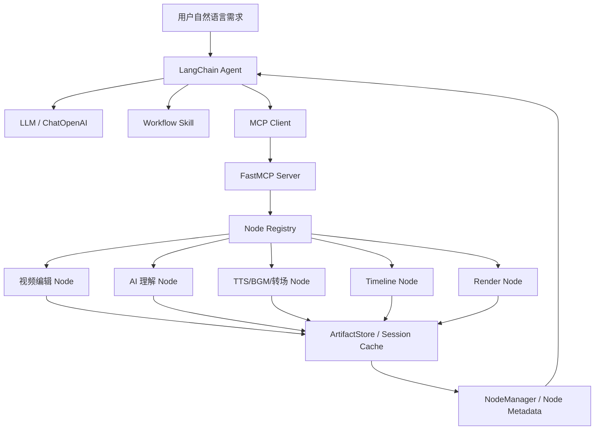
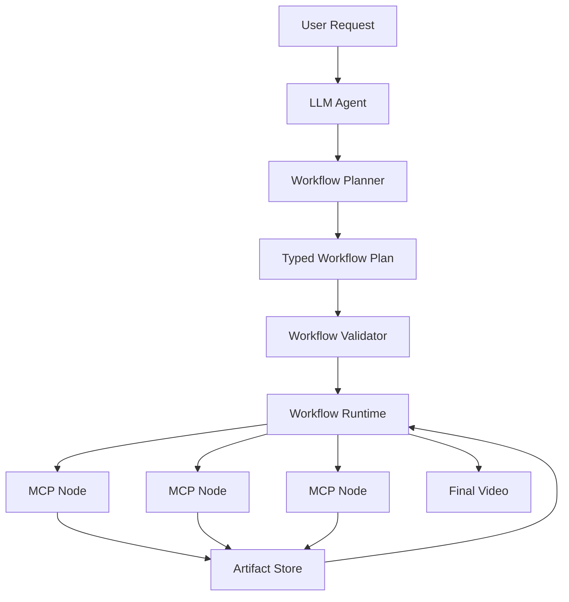

# FireRed-OpenStoryline 视频剪辑工作流与自动视频编辑节点映射技术分析

> 分析对象：`wayyet/FireRed-OpenStoryline`
>
> 分析时间：2026-09-18
>
> 核心问题：视频剪辑工作流程如何实现；自动视频编辑流程如何完成节点映射；普通/专业节点如何区分；底层采用什么技术；技术方案的优点与缺点是什么。

---

## 1. 结论先行

FireRed-OpenStoryline **不是基于 LangGraph 编译出来的固定 DAG 工作流**。

它的核心实现更接近：

```text
自然语言需求
    ↓
LangChain Agent
    ↓
LLM Tool Calling
    ↓
MCP Tools
    ↓
视频编辑 Node
    ↓
Artifact / Session 状态
    ↓
继续由 Agent 决定下一节点
```

工作流的“流程规范”主要来自 **Agent Skill**，节点的“依赖与可达关系”主要来自 **NodeMeta 元数据**，节点的“实际执行”通过 **MCP + LangChain Agent Tool Calling** 完成。

可以将整个方案概括成四层：

| 层 | 技术 | 作用 |
|---|---|---|
| Agent 层 | LangChain `create_agent` + `ChatOpenAI` | 根据用户需求选择工具、连续调用节点 |
| Workflow/Skill 层 | `.storyline/skills/*/SKILL.md` | 用自然语言 SOP 规定剪辑流程、固定节点、可选节点和特殊分支 |
| Node 层 | `BaseNode` + `NodeMeta` + `NODE_REGISTRY` | 把视频处理能力封装成标准节点 |
| Tool/Transport 层 | FastMCP + `langchain_mcp_adapters` | 把 Node 暴露成 MCP Tool，供 Agent 调用 |

最关键的一点是：

> **Skill 决定“应该怎么剪”，LLM Agent 决定“现在调用哪个工具”，Node 决定“具体怎么执行”。**

这是一种 **LLM 驱动的动态工作流编排（LLM-driven orchestration）**，而不是传统 Workflow Engine 的硬编码 DAG。

---

# 2. 整体技术架构

## 2.1 总体架构



其中：

- `LangChain Agent`：实际运行时的 Agent。
- `FastMCP`：把节点暴露成 MCP Tool。
- `NODE_REGISTRY`：负责扫描和注册 Node Class。
- `NodeMeta`：描述节点 ID、节点类型、前置依赖、后继节点等。
- `ArtifactStore`：保存节点执行结果，使后续节点能够读取历史输出。
- `Skill`：描述一套剪辑 SOP，而不是一个传统代码 Workflow。

代码依据：`agent.py` 使用 `create_agent()`，通过 `MultiServerMCPClient` 获取 MCP Tools，再把 `tools + skills` 一起交给 Agent。 

---

# 3. 视频自动剪辑工作流是如何定义的

## 3.1 默认剪辑 Skill

项目内置：

```text
.storyline/skills/default_editing_workflow_skill/SKILL.md
```

该 Skill 定义的默认流程是：

```text
search_media            可选
      ↓
load_media              固定
      ↓
split_shots            可选
      ↓
understand_clips       可选
      ↓
filter_clips            可选
      ↓
group_clips             可选，但默认运行
      ↓
generate_script        可选
      ↓
元素推荐                可选，但默认运行
      ↓
generate_voiceover    可选
      ↓
select_BGM             可选
      ↓
plan_timeline           固定
      ↓
render_video            固定
```

因此，它没有把全部流程写成一个固定的 Python `WorkflowGraph`。

相反，它把流程写成 Agent 可以理解的 **文本 SOP**。

### 3.2 为什么 Skill 可以充当 Workflow

例如 Skill 会告诉 Agent：

```text
素材加载 load_media：固定
镜头切分 split_shots：可跳过
内容理解 understand_clips：可跳过
片段分组 group_clips：可跳过，但应默认运行
组织时间线 plan_timeline：固定
渲染 render_video：固定
```

这实际上相当于告诉 LLM：

```text
哪些节点必须执行
哪些节点可以跳过
哪些节点通常默认执行
节点之间的大致业务顺序
特殊需求应该走哪个 Skill
```

因此它更接近：

> **Prompt-defined Workflow / Skill-defined Workflow**

而不是：

> **Code-defined DAG Workflow**。

---

# 4. 节点是如何实现的

## 4.1 BaseNode 抽象

所有核心节点继承：

```python
class BaseNode(ABC):
```

每个 Node 至少提供两个执行入口：

```python
async def default_process(...):
    ...

async def process(...):
    ...
```

BaseNode 的 `__call__()` 根据 `mode` 选择执行路径：

```python
mode = params.get("mode", "auto")

if mode != 'auto':
    outputs = await self.default_process(node_state, parsed_inputs)
else:
    outputs = await self.process(node_state, parsed_inputs)
```

因此这里实际上存在一个重要的“双路径执行模型”：

```text
                    Node
                     │
              ┌──────┴──────┐
              │             │
          mode=auto      mode!=auto
              │             │
              ▼             ▼
          process()   default_process()
              │             │
         完整处理逻辑     默认/跳过逻辑
```

这就是项目里“普通执行 / 默认执行 / 跳过执行”的主要实现机制之一。

需要特别说明：

> **这不是“专业节点 / 普通节点”的统一框架。**
>
> 它是 Node 的两种执行路径。

---

# 5. NodeMeta：节点映射和依赖关系的核心

## 5.1 NodeMeta 字段

`BaseNode` 中定义了：

```python
@dataclass
class NodeMeta:
    name: str
    description: str
    node_id: str
    node_kind: str
    require_prior_kind: List[str]
    default_require_prior_kind: List[str]
    next_available_node: List[str]
    priority: int
```

字段含义：

| 字段 | 含义 |
|---|---|
| `name` | MCP Tool 名称 |
| `node_id` | Node 唯一 ID |
| `node_kind` | 节点业务类型 |
| `require_prior_kind` | 正常 `auto/process` 路径所依赖的前置能力 |
| `default_require_prior_kind` | 默认路径所依赖的前置能力 |
| `next_available_node` | 当前节点允许继续到达的节点 |
| `priority` | 同类节点的优先级 |

因此节点自身已经带有一部分 Workflow 元数据。

---

# 6. NodeManager 如何做节点映射

`NodeManager` 建立了多个索引：

```python
kind_to_node_ids
id_to_tool
id_to_next
id_to_priority
id_to_kind
id_to_require_prior_kind
id_to_default_require_prior_kind
```

可以理解成：

```text
node_kind
   ↓
多个 node_id
   ↓
具体 MCP Tool
```

以及：

```text
node_id
   ├── require_prior_kind
   ├── default_require_prior_kind
   └── next_available_node
```

### 6.1 `check_excutable()` 的作用

`NodeManager.check_excutable()` 会：

1. 根据 `node_kind` 找到相关节点。
2. 查询 `ArtifactStore` 的历史执行结果。
3. 找出某个 kind 最近生成的 Artifact。
4. 判断所需前置能力是否已经具备。

因此它并不是单纯的“节点注册表”，还包含了：

> **基于历史 Artifact 的前置条件可执行性判断。**

这使节点之间的连接不完全依赖内存中的变量，而可以依赖会话历史中的 Artifact。

---

# 7. MCP 是如何把 Node 变成 Agent 可以调用的工具

## 7.1 Node Registry

节点通过：

```python
@NODE_REGISTRY.register()
class XXXNode(BaseNode):
```

注册。

Registry 支持：

```python
scan_package()
```

扫描 `open_storyline.nodes.core_nodes`，导入模块，使装饰器完成 Node 注册。

---

## 7.2 MCP Tool Wrapper

`register_tools.py` 会把：

```text
BaseNode
   ↓
create_tool_wrapper()
   ↓
FastMCP server.tool()
   ↓
MCP Tool
```

封装完成。

Wrapper 会创建：

```python
NodeState(
    session_id=session_id,
    artifact_id=params['artifact_id'],
    lang=params.get('lang', 'zh'),
    node_summary=NodeSummary(),
    llm=make_llm(mcp_ctx),
    mcp_ctx=mcp_ctx,
)
```

然后实际执行：

```python
result = await node(node_state, **params)
```

所以最终 Agent 看到的并不是一个“普通 Python Class”，而是一个标准 MCP Tool。

---

# 8. Agent 如何真正执行 Workflow

`agent.py` 中的核心逻辑是：

```python
client = MultiServerMCPClient(...)
tools = await client.get_tools()
skills = await load_skills(...)

agent = create_agent(
    model=llm,
    tools=tools+skills,
    middleware=[log_tool_request, handle_tool_errors],
    store=store,
    context_schema=ClientContext,
)
```

这说明运行时核心是：

```text
LLM
 ↓
LangChain Agent
 ↓
Tool Calling
 ↓
MCP Tool
 ↓
Node
 ↓
Artifact
 ↓
下一轮 Tool Calling
```

因此：

> **LangChain Agent 是实际编排运行时；Skill 是流程约束；NodeManager 是节点元数据/依赖管理组件。**

不能把整个系统理解成“NodeManager 直接执行 DAG”。

---

# 9. 自动视频编辑完整节点映射

## 9.1 主流程


其中很多节点不是强制执行。

---

## 9.2 节点详细映射

| 阶段 | Node | 类型 | 主要技术 | 是否依赖 LLM | 作用 |
|---|---|---|---|---|---|
| 素材搜索 | `search_media` | 普通节点 | Pexels API + requests | 否 | 搜索/下载视频与图片 |
| 素材加载 | `load_media` | 固定节点 | PyAV / MoviePy / PIL | 否 | 读取媒体元数据 |
| 镜头切分 | `split_shots` | 普通节点 | TransNetV2 + 视频处理 | 可选 | 镜头边界检测 |
| 视觉理解 | `understand_clips` | AI 节点 | VLM | 是 | 为 Clip 生成描述/语义信息 |
| 筛选 | `filter_clips` | AI 节点 | LLM + JSON | 是 | 根据用户需求选择 Clip |
| 分组 | `group_clips` | AI 节点 | LLM + JSON | 是 | 组织叙事组 |
| 文案 | `generate_script` | AI 节点 | LLM + Prompt | 是 | 生成脚本/字幕 |
| ASR | `LocalASRNode` | AI/音频节点 | ASR | 是/模型相关 | 生成语音转写和时间戳 |
| 口播粗剪 | `speech_rough_cut` | 专项节点 | LLM + FFmpeg + ASR | 是 | 删除冗余口播内容 |
| AI 转场 | `generate_ai_transition` | 专项节点 | 图像处理 + 第三方视频生成 API | 是/服务相关 | 生成 AI 转场视频 |
| 配音 | `generate_voiceover` | AI/外部服务节点 | TTS | 是/参数推断 | 生成旁白 |
| BGM | `select_BGM` | 音频节点 | 音频特征分析 | 否/弱 LLM | 选择背景音乐、节拍信息 |
| 花字 | `recommend_text` | 推荐节点 | LLM + 字体库 | 是 | 推荐字幕/字体样式 |
| 转场推荐 | `recommend_transition` | 推荐节点 | LLM | 是 | 推荐转场 |
| 时间线 | `plan_timeline` | 普通 | Python TimelinePlanner | 否 | 组织普通时间线 |
| 时间线 | `plan_timeline_pro` | 专业/增强 | 自定义 TimeLine 算法 | 否 | TTS/字幕/节拍/时长精细编排 |
| 渲染 | `render_video` | 固定节点 | MoviePy + FFmpeg | 否 | 输出最终视频 |

配置文件当前注册的核心节点包括上述节点，以及 `PlanTimelineProNode`、`PlanTimelineAITransitionNode` 等。 

---

# 10. “普通节点 / 专业节点”到底是怎么实现的

这里需要区分两个概念。

## 10.1 概念一：Node 的普通/默认执行路径

这是：

```text
mode=auto
    → process()

mode!=auto
    → default_process()
```

例如 `SearchMediaNode`：

```python
async def default_process(...):
    return {}
```

表示在默认/非 auto 模式下可以直接跳过实际搜索。

`GenerateVoiceoverNode` 的默认路径也可以直接返回空的 voiceover。

所以这是：

> **Node Execution Mode**

不是“专业节点”。

---

## 10.2 概念二：Pro Node

当前代码中最明确的专业化节点是：

```text
plan_timeline
plan_timeline_pro
```

普通 Timeline：

```python
class PlanTimelineNode(BaseNode)
```

专业 Timeline：

```python
class PlanTimelineProNode(BaseNode)
```

二者都属于：

```python
node_kind="plan_timeline"
```

说明 Pro 并没有设计成一个全新的 Workflow Engine。

它只是：

> **在同一个业务能力 kind 下提供更复杂的实现。**

---

# 11. 普通 Timeline 与 Pro Timeline 的技术差异

## 11.1 普通 Timeline

普通版本主要调用：

```python
self.planner.plan(...)
```

输入包括：

```text
media
clips
groups
group_scripts
voiceovers
background_music
use_beats
```

其核心职责是：

- 组织 Clip
- 根据 Group 组织顺序
- 结合脚本
- 结合 TTS
- 结合 BGM
- 可按节拍组织

---

## 11.2 Pro Timeline

Pro 版本内部使用：

```python
class TimeLine:
```

它增加了更细的时间轴控制，包括：

```text
TTS duration
text duration
text start timestamp
text/TTS offset
group margin
music beat
speech rough cut
AI transition
target_duration_ms
clip speed
```

例如：

```python
apply_target_duration(...)
```

可以根据用户目标总时长进行比例裁剪。

同时它明确处理：

```text
is_speech_rough_cut
is_ai_transition
```

这些都是普通 Timeline 不具备或没有直接体现的增强处理路径。

---

# 12. 一个完整的实际执行例子

假设用户输入：

```text
把我上传的旅行视频剪成 30 秒的中文短视频。
节奏轻快，配轻音乐，有字幕和中文配音。
```

Agent 可以形成类似下面的执行链：

```text
1. load_media
      ↓
2. split_shots
      ↓
3. understand_clips
      ↓
4. filter_clips
      ↓
5. group_clips
      ↓
6. generate_script
      ↓
7. generate_voiceover
      ↓
8. select_BGM
      ↓
9. recommend_text
      ↓
10. plan_timeline_pro
      ↓
11. render_video
```

其中真正的决策不是由代码直接写成：

```python
workflow = [
    load_media,
    split_shots,
    ...
]
```

而是：

```text
Skill 告诉 Agent 应遵循什么流程
        ↓
LLM 判断当前需求需要哪些节点
        ↓
Agent 调 MCP Tool
        ↓
Node 返回 Artifact
        ↓
Agent 读取结果
        ↓
继续选择下一个 Tool
```

这就是该项目最核心的自动编排方式。

---

# 13. 优点分析

## 13.1 优点一：工作流非常灵活

传统 DAG：

```text
A → B → C → D
```

路径基本固定。

OpenStoryline：

```text
LLM
 ↓
根据需求动态决定
 ↓
A / B / C / D / E...
```

例如：

```text
普通 Vlog
→ load → split → understand → group → script → timeline → render
```

口播视频：

```text
load → ASR → speech_rough_cut → recommend_text → timeline → render
```

需要 AI 转场：

```text
... → generate_ai_transition → plan_timeline_pro → render
```

因此一个 Agent 可以覆盖多个业务场景。

---

## 13.2 优点二：节点扩展成本低

增加一个节点主要需要：

```python
class XXXNode(BaseNode):
    meta = NodeMeta(...)
```

然后通过：

```python
@NODE_REGISTRY.register()
```

注册。

再由 MCP Wrapper 暴露出去。

不需要修改一个庞大的中心化 Workflow Engine。

---

## 13.3 优点三：Node 与 Agent 解耦

Node 不关心：

```text
用户说了什么
Agent 怎么推理
下一步是什么
```

Node 主要关心：

```text
输入
→ 处理
→ 输出
```

例如：

```text
GenerateScriptNode
```

只负责：

```text
Group + Clip Caption + Duration
        ↓
LLM
        ↓
Script JSON
```

这符合 Tool/Agent 架构的基本思想。

---

## 13.4 优点四：Skill 可以保存“剪辑经验”

项目把完整剪辑逻辑保存为：

```text
.storyline/skills/*/SKILL.md
```

因此可以把：

```text
快节奏 Vlog
产品种草
旅行片
口播粗剪
```

分别变成 Skill。

本质上是：

```text
专家经验
   ↓
Markdown Skill
   ↓
Agent
   ↓
节点组合
```

这比把所有规则写死在 Python 里更容易维护。

---

## 13.5 优点五：Artifact 能支持跨节点状态传递

节点输出不会只存在函数返回值里，而是通过 Artifact/Session Cache 保存。

例如：

```text
split_shots
      ↓
artifact
      ↓
understand_clips
      ↓
artifact
      ↓
group_clips
```

NodeManager 还能基于 `node_kind` 查询最近 Artifact。

这使得：

- 对话恢复
- 历史节点查询
- 重跑单节点
- Debug
- Agent 读取过去结果

都更容易实现。

---

## 13.6 优点六：MCP 让节点天然具备跨 Agent 能力

节点最终暴露成 MCP Tool 后，理论上不仅 OpenStoryline 自己的 Agent 可以使用，其他 MCP Client 也可以调用。

因此节点层天然具备一定的复用能力。

---

## 13.7 优点七：专业能力与基础能力可以并存

例如：

```text
plan_timeline
plan_timeline_pro
```

可以并行存在。

这避免了：

```text
为了支持专业需求
→ 把普通流程全部重写
```

而是：

```text
基础实现
   +
高级实现
```

这是比较好的渐进式设计。

---

# 14. 缺点分析

## 14.1 缺点一：LLM 决定流程，会产生非确定性

最大的工程问题是：

```text
同一个用户需求
      ↓
不同模型 / 不同上下文
      ↓
可能选择不同节点
```

例如可能出现：

```text
情况 A
load → split → understand → group → timeline

情况 B
load → understand → group → timeline

情况 C
load → split → understand → filter → group → script → TTS → BGM → timeline
```

这对生产环境的：

- 可预测性
- 可测试性
- SLA
- 成本控制
- 调试

都不利。

---

# 15. 缺点二：Skill 本质是 Prompt，不是强类型 Workflow

Skill 中写：

```text
load_media 固定
split_shots 可跳过
```

LLM 仍然可能理解偏差。

而传统 Workflow Engine 可以直接在代码层保证：

```text
B 未完成
→ C 不允许执行
```

OpenStoryline 更多依赖：

```text
Prompt
+
NodeMeta
+
Artifact 检查
```

属于软约束与半结构化约束。

---

# 16. 缺点三：NodeMeta 不是完整 Workflow DSL

虽然有：

```text
require_prior_kind
next_available_node
priority
```

但它仍然不是完整的：

```text
DAG
State Machine
Workflow DSL
```

缺失或弱化的部分包括：

- 显式条件分支
- 并行节点
- 汇聚节点
- 重试策略
- 超时策略
- Saga/补偿
- 幂等策略
- 节点事务
- 强类型 Workflow State
- 编译期校验

因此对于复杂企业工作流，它的约束能力不够强。

---

# 17. 缺点四：节点映射存在一定的“代码痕迹不一致”

当前代码中可以看到一些类似：

```text
split_shots_pro
generate_script_pro
```

的下一节点引用。

但当前 `config.toml` 的 `available_nodes` 只显式注册了主要节点，并没有将这些名字全部作为可用节点注册。

这说明项目中存在一定的：

```text
历史代码
实验能力
未来扩展
当前配置
```

之间不同步的问题。

这类问题在生产环境中可能表现为：

```text
Agent 认为节点存在
        ↓
MCP 实际没有暴露
        ↓
调用失败 / 回退
```

因此需要增加启动期 Workflow/Node consistency check。

---

# 18. 缺点五：NodeManager 当前更像“元数据管理器”，不是完整编排引擎

虽然 `NodeManager` 有：

```text
id_to_next
require_prior_kind
check_excutable
```

但 Agent 的实际运行入口依旧是：

```python
create_agent(...)
```

而不是：

```text
NodeManager.compile()
NodeManager.run()
```

因此 NodeManager 并没有成为一个真正意义上的：

```text
Workflow Runtime
```

这会导致：

```text
元数据
+
Prompt
+
LLM Tool Calling
+
实际 Node Runtime
```

之间存在一定的职责分散。

---

# 19. 缺点六：测试复杂度明显高于 DAG Workflow

传统 DAG：

```text
固定输入
→ 固定节点
→ 固定输出
```

容易做：

```text
Unit Test
Integration Test
E2E Test
```

LLM 驱动后：

```text
输入
→ LLM
→ 动态节点选择
→ 动态参数
→ 动态顺序
```

测试会变成：

```text
Golden Dataset
+
Tool-call Trace
+
Workflow Constraint Test
+
LLM Evaluation
```

成本明显增加。

---

# 20. 缺点七：模型错误可能变成“流程错误”

例如模型错误判断：

```text
用户只是要剪掉废话
```

却决定调用：

```text
generate_script
→ generate_voiceover
→ select_BGM
```

最终得到的并不是“功能错误”，而是：

> **Workflow Selection Error**

这类错误比普通函数 Bug 更难定位。

---

# 21. 缺点八：成本不可完全预测

LLM 控制了：

```text
调用哪些节点
调用几次
是否重试
是否重新规划
```

因此一次视频任务的模型 Token 成本可能随着输入和模型决策变化。

尤其是：

```text
understand_clips
filter_clips
group_clips
generate_script
speech_rough_cut
```

均可能涉及 LLM/VLM。

如果用于生产环境，建议引入：

```text
Workflow Budget
Token Budget
Tool Call Budget
Time Budget
```

---

# 22. 推荐的技术架构演进方向

如果这个项目继续向企业级自动视频剪辑平台演进，建议保留当前架构的优点，但增加一个真正的 Workflow Runtime。

建议演进成：



其中 LLM 不直接决定每一步的执行细节，而是生成：

```json
{
  "workflow": "travel_vlog",
  "steps": [
    {"node": "load_media"},
    {"node": "split_shots"},
    {"node": "understand_clips"},
    {"node": "group_clips"},
    {"node": "generate_script"},
    {"node": "generate_voiceover"},
    {"node": "select_BGM"},
    {"node": "plan_timeline_pro"},
    {"node": "render_video"}
  ]
}
```

然后由 Runtime 做：

```text
Schema 校验
↓
依赖校验
↓
权限校验
↓
预算校验
↓
执行
↓
重试
↓
恢复
↓
审计
```

这样可以兼顾：

```text
LLM 的灵活性
+
Workflow Engine 的确定性
```

---

# 23. 最终技术判断

## 23.1 它使用的核心技术

```text
LangChain Agent
        +
OpenAI-compatible LLM
        +
MCP / FastMCP
        +
langchain-mcp-adapters
        +
Agent Skills
        +
BaseNode / NodeMeta
        +
Node Registry
        +
NodeManager
        +
ArtifactStore
        +
FFmpeg / MoviePy / PyAV
        +
VLM / ASR / TTS / BGM Analysis
```

---

## 23.2 它的 Workflow 本质

不是：

```text
LangGraph DAG
```

也不是：

```text
传统 BPM / Workflow Engine
```

更准确地说是：

```text
Skill-defined Workflow
        +
LLM-driven Tool Orchestration
        +
Metadata-based Node Dependency
        +
Artifact-based State
```

即：

> **基于 Skill 定义流程规范，基于 LLM 进行动态节点选择，基于 NodeMeta 表达节点依赖，基于 MCP 执行节点，基于 Artifact 保存跨节点状态。**

---

# 24. 普通/专业节点最终映射

| 维度 | 普通机制 | 专业/增强机制 |
|---|---|---|
| Workflow | Default Editing Skill | 专项 Skill，如 speech rough cut |
| Node 执行 | `default_process()` | `process()` |
| 时间线 | `plan_timeline` | `plan_timeline_pro` |
| 时间轴算法 | `TimelinePlanner` | `TimeLine` |
| TTS 对齐 | 基础处理 | 更细粒度时间调整 |
| 字幕时间 | 基础 | TTS/Clip/Beat 多策略 |
| 总时长 | 基础 | `target_duration_ms` |
| AI 转场 | 无/可选 | `generate_ai_transition` |
| 口播粗剪 | 无/可选 | `speech_rough_cut` |
| 编排方式 | LLM Tool Calling | LLM Tool Calling + 专项节点 |

这里最重要的是：

> **“专业”不是一个统一的 Node 类型体系，而是通过 Pro Node、专项 Node、专项 Skill 组合出来的。**

---

# 25. 优缺点总表

| 维度 | 优点 | 缺点 |
|---|---|---|
| 灵活性 | 非常高 | 不确定性高 |
| 节点扩展 | 简单 | 缺少统一强类型 Workflow Contract |
| AI 能力 | Agent 可以动态选择能力 | 模型错误会导致流程错误 |
| Skill | 专家经验可复用 | 本质仍是 Prompt |
| MCP | Node 解耦、可跨 Agent 复用 | Tool 数量变多后发现与治理变复杂 |
| Artifact | 支持跨节点状态和恢复 | 状态关系较分散 |
| Pro Node | 可以逐步增强核心能力 | 普通/专业模型不是全局统一规范 |
| 开发成本 | 初期较低 | 企业化后测试和治理成本会上升 |
| 可观测性 | Tool 调用天然可追踪 | LLM 决策本身需要额外审计 |
| 生产稳定性 | 中小复杂度场景较灵活 | 不如编译型 DAG / Workflow Engine 确定 |

---

# 26. 建议

如果目标是：

### A. 快速实现 AI 视频编辑 Agent

当前架构是合理的：

```text
Skill
+
LangChain Agent
+
MCP
+
Node
```

它能快速扩展能力。

### B. 做企业级大规模自动视频生产

建议升级为：

```text
LLM Planner
        ↓
Typed Workflow Plan
        ↓
Workflow Validator
        ↓
Deterministic Workflow Runtime
        ↓
MCP Node
```

即：

> **LLM 负责“规划”，Workflow Engine 负责“执行”。**

这样可以显著降低：

- 非确定性
- Token 成本失控
- 节点误调用
- 工作流死循环
- 难以测试
- 难以审计

---

# 27. 关键源码位置

以下路径是本次分析最关键的代码位置：

```text
src/open_storyline/agent.py
src/open_storyline/nodes/node_manager.py
src/open_storyline/nodes/core_nodes/base_node.py
src/open_storyline/mcp/register_tools.py
src/open_storyline/mcp/server.py
src/open_storyline/nodes/core_nodes/plan_timeline.py
src/open_storyline/nodes/core_nodes/plan_timeline_pro.py
src/open_storyline/nodes/core_nodes/render_video.py
src/open_storyline/nodes/core_nodes/group_clips.py
src/open_storyline/nodes/core_nodes/generate_script.py
src/open_storyline/nodes/core_nodes/generate_voiceover.py
src/open_storyline/nodes/core_nodes/speech_rough_cut.py
src/open_storyline/nodes/core_nodes/generate_ai_transition.py
.storyline/skills/default_editing_workflow_skill/SKILL.md
config.toml
```

---

# 28. 主要参考来源

1. FireRed-OpenStoryline（用户指定仓库）
   - https://github.com/wayyet/FireRed-OpenStoryline
2. Agent 构建
   - https://raw.githubusercontent.com/wayyet/FireRed-OpenStoryline/main/src/open_storyline/agent.py
3. NodeManager
   - https://raw.githubusercontent.com/wayyet/FireRed-OpenStoryline/main/src/open_storyline/nodes/node_manager.py
4. BaseNode / NodeMeta
   - https://raw.githubusercontent.com/wayyet/FireRed-OpenStoryline/main/src/open_storyline/nodes/core_nodes/base_node.py
5. MCP Tool 注册
   - https://raw.githubusercontent.com/wayyet/FireRed-OpenStoryline/main/src/open_storyline/mcp/register_tools.py
6. MCP Server
   - https://raw.githubusercontent.com/wayyet/FireRed-OpenStoryline/main/src/open_storyline/mcp/server.py
7. 默认视频剪辑 Skill
   - https://raw.githubusercontent.com/wayyet/FireRed-OpenStoryline/main/.storyline/skills/default_editing_workflow_skill/SKILL.md
8. 普通 Timeline
   - https://raw.githubusercontent.com/wayyet/FireRed-OpenStoryline/main/src/open_storyline/nodes/core_nodes/plan_timeline.py
9. Pro Timeline
   - https://raw.githubusercontent.com/wayyet/FireRed-OpenStoryline/main/src/open_storyline/nodes/core_nodes/plan_timeline_pro.py
10. Render
   - https://raw.githubusercontent.com/wayyet/FireRed-OpenStoryline/main/src/open_storyline/nodes/core_nodes/render_video.py
11. Group Clips
   - https://raw.githubusercontent.com/wayyet/FireRed-OpenStoryline/main/src/open_storyline/nodes/core_nodes/group_clips.py
12. Generate Script
   - https://raw.githubusercontent.com/wayyet/FireRed-OpenStoryline/main/src/open_storyline/nodes/core_nodes/generate_script.py
13. Speech Rough Cut
   - https://raw.githubusercontent.com/wayyet/FireRed-OpenStoryline/main/src/open_storyline/nodes/core_nodes/speech_rough_cut.py
14. AI Transition
   - https://raw.githubusercontent.com/wayyet/FireRed-OpenStoryline/main/src/open_storyline/nodes/core_nodes/generate_ai_transition.py

---

# 29. 一句话总结

**FireRed-OpenStoryline 的视频自动剪辑，本质上是“Skill 定义流程 + LangChain Agent 做动态编排 + MCP 暴露节点 + NodeMeta 表达依赖 + Artifact 保存状态 + 专业节点提供增强算法”，而不是传统的固定 DAG 工作流。**
